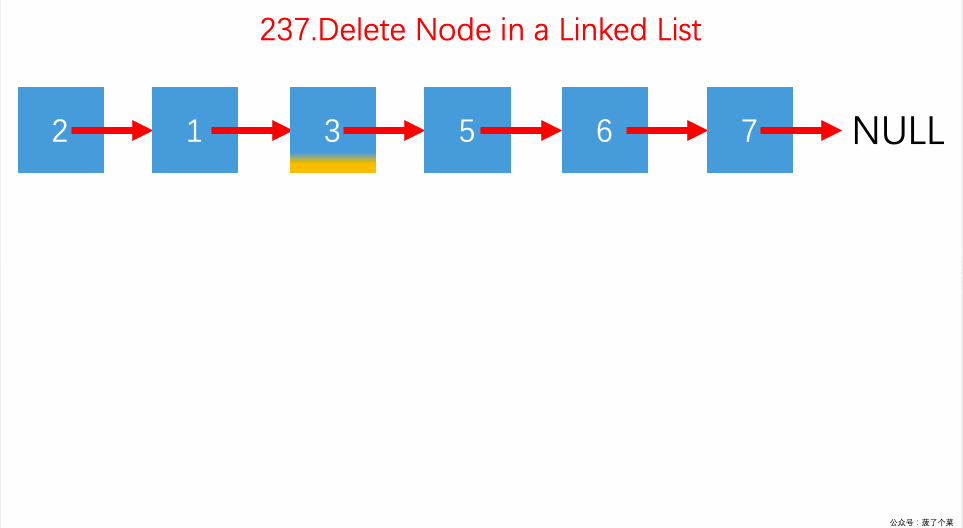

# leetcode

从leetcode上选取一些题目，采用文档和动态图的形式介绍每道题的题目描述和解题思路。
<!-- TOC -->

- [leetcode](#leetcode)
- [数组](#数组)
    - [**Two Sum  两数之和**](#two-sum--两数之和)
        - [*问题*](#问题)
        - [*思路*](#思路)
        - [*代码*](#代码)
    - [**Two Sum II - Input array is sorted  两数之和II-输入有序数组**](#two-sum-ii---input-array-is-sorted--两数之和ii-输入有序数组)
        - [*问题*](#问题-1)
        - [*思路*](#思路-1)
        - [*代码*](#代码-1)
    - [**3Sum  三数之和**](#3sum--三数之和)
        - [*问题*](#问题-2)
        - [*代码*](#代码-2)
    - [**4Sum  四数之和**](#4sum--四数之和)
        - [*问题*](#问题-3)
        - [*代码*](#代码-3)
    - [**4Sum II  四数相加II**](#4sum-ii--四数相加ii)
        - [*问题*](#问题-4)
        - [*思路*](#思路-2)
        - [*代码*](#代码-4)
    - [**Sort Colors  颜色分类**](#sort-colors--颜色分类)
        - [*问题*](#问题-5)
        - [*思路*](#思路-3)
        - [*代码*](#代码-5)
    - [**Move Zeroes  移动零**](#move-zeroes--移动零)
        - [*问题*](#问题-6)
        - [*思路*](#思路-4)
        - [*代码*](#代码-6)
    - [**Minimum Size Subarray Sum  长度最小的数组**](#minimum-size-subarray-sum--长度最小的数组)
        - [*问题*](#问题-7)
        - [*思路*](#思路-5)
        - [*代码*](#代码-7)
    - [**Intersection of Two Arrays   两个数组的交集**](#intersection-of-two-arrays---两个数组的交集)
        - [*问题*](#问题-8)
        - [*思路*](#思路-6)
        - [*代码*](#代码-8)
    - [**Intersection of Two Arrays II   两个数组的交集II**](#intersection-of-two-arrays-ii---两个数组的交集ii)
        - [*问题*](#问题-9)
        - [*思路*](#思路-7)
        - [*代码*](#代码-9)
    - [**Number of Boomerangs  回文镖的数量**](#number-of-boomerangs--回文镖的数量)
        - [*问题*](#问题-10)
        - [*思路*](#思路-8)
        - [*代码*](#代码-10)
    - [**Contains Duplicate II  存在重复元素II**](#contains-duplicate-ii--存在重复元素ii)
        - [*问题*](#问题-11)
        - [*思路*](#思路-9)
        - [*代码*](#代码-11)
    - [**Single Number  只出现一次的数字**](#single-number--只出现一次的数字)
        - [*问题*](#问题-12)
        - [*代码*](#代码-12)
    - [**Single Number II   只出现一次的数字II**](#single-number-ii---只出现一次的数字ii)
        - [*问题*](#问题-13)
        - [*代码*](#代码-13)
    - [**Single Number III   只出现一次的数字III**](#single-number-iii---只出现一次的数字iii)
        - [*问题*](#问题-14)
        - [*代码*](#代码-14)
    - [**Find the Duplicate Number   寻找重复数**](#find-the-duplicate-number---寻找重复数)
        - [*问题*](#问题-15)
        - [*代码*](#代码-15)
    - [**Majority Element  求众数**](#majority-element--求众数)
        - [*问题*](#问题-16)
        - [*代码*](#代码-16)
    - [**Reverse Bits  颠倒二进制位**](#reverse-bits--颠倒二进制位)
        - [*问题*](#问题-17)
        - [*代码*](#代码-17)
    - [**Number of 1 Bits   位1的个数**](#number-of-1-bits---位1的个数)
        - [*问题*](#问题-18)
        - [*代码*](#代码-18)
    - [**Power of two   2的幂**](#power-of-two---2的幂)
        - [*问题*](#问题-19)
        - [*代码*](#代码-19)
    - [**Power of four  4的幂**](#power-of-four--4的幂)
        - [*问题*](#问题-20)
        - [*思路*](#思路-10)
        - [*代码*](#代码-20)
    - [**Power of three  3的幂**](#power-of-three--3的幂)
        - [*问题*](#问题-21)
        - [*代码*](#代码-21)
    - [**Counting Bits  比特位计数**](#counting-bits--比特位计数)
        - [*问题*](#问题-22)
        - [*代码*](#代码-22)
    - [**Missing Number  缺失的数字**](#missing-number--缺失的数字)
        - [*问题*](#问题-23)
        - [*代码*](#代码-23)
    - [**Sum of Two Integers   两整数之和**](#sum-of-two-integers---两整数之和)
        - [*问题*](#问题-24)
        - [*代码*](#代码-24)
    - [**Sliding Window Maximum  滑动窗口最大值**](#sliding-window-maximum--滑动窗口最大值)
        - [*问题*](#问题-25)
        - [*代码*](#代码-25)
    - [**Kth Largest Element in a Stream  数据流中的第K大元素**](#kth-largest-element-in-a-stream--数据流中的第k大元素)
        - [*问题*](#问题-26)
        - [*代码*](#代码-26)
    - [**Sqrt(x)  x的平方根**](#sqrtx--x的平方根)
        - [*问题*](#问题-27)
        - [*代码*](#代码-27)
    - [**Median of Two Sorted Arrays  寻找两个有序数组的中位数**](#median-of-two-sorted-arrays--寻找两个有序数组的中位数)
        - [*问题*](#问题-28)
        - [*代码*](#代码-28)
    - [**Container With Most Water  盛最多水的容器**](#container-with-most-water--盛最多水的容器)
        - [*问题*](#问题-29)
        - [*代码*](#代码-29)
- [字符串](#字符串)
    - [**Reverse String反转字符串**](#reverse-string反转字符串)
        - [*问题*](#问题-30)
        - [*思路*](#思路-11)
        - [*代码*](#代码-30)
    - [**Longest Substring Without Repeating Characters   无重复字符的最长子串**](#longest-substring-without-repeating-characters---无重复字符的最长子串)
        - [*问题*](#问题-31)
        - [*思路*](#思路-12)
        - [*代码*](#代码-31)
    - [**Find the Difference  找不同**](#find-the-difference--找不同)
        - [*问题*](#问题-32)
        - [*代码*](#代码-32)
    - [**Valid Anagram 有效的字母异位词**](#valid-anagram-有效的字母异位词)
        - [*问题*](#问题-33)
        - [*代码*](#代码-33)
    - [**Simplify Path  简化路径**](#simplify-path--简化路径)
        - [*问题*](#问题-34)
        - [*代码*](#代码-34)
    - [**Longest Palindromic Substring  最长回文子串**](#longest-palindromic-substring--最长回文子串)
        - [*问题*](#问题-35)
        - [*代码*](#代码-35)
    - [**Letter Combinations of a Phone Number  电话号码的字母组合**](#letter-combinations-of-a-phone-number--电话号码的字母组合)
        - [*问题*](#问题-36)
        - [*代码*](#代码-36)
- [链表](#链表)
    - [**Remove Linked List Elements  移除链表元素**](#remove-linked-list-elements--移除链表元素)
        - [*问题*](#问题-37)
        - [*思路*](#思路-13)
        - [*代码*](#代码-37)
    - [**Swap Nodes in Pairs  两两交换链表中的节点**](#swap-nodes-in-pairs--两两交换链表中的节点)
        - [*问题*](#问题-38)
        - [*思路*](#思路-14)
        - [*代码*](#代码-38)
    - [**Partition List  分隔链表**](#partition-list--分隔链表)
        - [*问题*](#问题-39)
        - [*思路*](#思路-15)
        - [*代码*](#代码-39)
    - [**Odd Even Linked List  奇偶链表**](#odd-even-linked-list--奇偶链表)
        - [*问题*](#问题-40)
        - [*思路*](#思路-16)
        - [*代码*](#代码-40)
    - [**Delete Node in a Linked List  删除链表中的节点**](#delete-node-in-a-linked-list--删除链表中的节点)
        - [*问题*](#问题-41)
        - [*思路*](#思路-17)
        - [*代码*](#代码-41)
    - [**Reverse Linked List  反转链表**](#reverse-linked-list--反转链表)
        - [*问题*](#问题-42)
        - [*思路*](#思路-18)
        - [*代码*](#代码-42)
    - [**Reverse Linked List II   反转链表II**](#reverse-linked-list-ii---反转链表ii)
        - [*问题*](#问题-43)
        - [*思路*](#思路-19)
        - [*代码*](#代码-43)
    - [**Remove Duplicates from Sorted List II   删除排序链表中的重复元素II**](#remove-duplicates-from-sorted-list-ii---删除排序链表中的重复元素ii)
        - [*问题*](#问题-44)
        - [*代码*](#代码-44)
    - [**Rotate List  旋转链表**](#rotate-list--旋转链表)
        - [*问题*](#问题-45)
        - [*代码*](#代码-45)
    - [**Linked List Cycle  环状链表**](#linked-list-cycle--环状链表)
        - [*问题*](#问题-46)
        - [*代码*](#代码-46)
    - [**Merge Two Sorted Lists  合并两个有序链表**](#merge-two-sorted-lists--合并两个有序链表)
        - [*问题*](#问题-47)
        - [*代码*](#代码-47)
    - [**Merge k Sorted Lists  合并k个有排序链表**](#merge-k-sorted-lists--合并k个有排序链表)
        - [*问题*](#问题-48)
        - [*代码*](#代码-48)
    - [**Reverse Nodes in k-Group   K个一组反转链表**](#reverse-nodes-in-k-group---k个一组反转链表)
        - [*问题*](#问题-49)
        - [*代码*](#代码-49)
    - [**Remove Nth Node From End of List   删除链表的倒数第N个节点**](#remove-nth-node-from-end-of-list---删除链表的倒数第n个节点)
        - [*问题*](#问题-50)
        - [*代码*](#代码-50)
    - [**Middle of the Linked List   链表的中间节点**](#middle-of-the-linked-list---链表的中间节点)
        - [*问题*](#问题-51)
        - [*代码*](#代码-51)
    - [**Design Linked List   设计链表**](#design-linked-list---设计链表)
        - [*问题*](#问题-52)
        - [*代码*](#代码-52)
    - [**Add Two Numbers 两数相加**](#add-two-numbers-两数相加)
        - [*问题*](#问题-53)
        - [*代码*](#代码-53)
- [栈](#栈)
    - [**Min Stack   最小栈**](#min-stack---最小栈)
        - [*问题*](#问题-54)
        - [*代码*](#代码-54)
    - [**Valid Parentheses   有效的括号**](#valid-parentheses---有效的括号)
        - [*问题*](#问题-55)
        - [*思路*](#思路-20)
        - [*代码*](#代码-55)
    - [**Evaluate Reverse Polish Notation  逆波兰表达式求值**](#evaluate-reverse-polish-notation--逆波兰表达式求值)
        - [*问题*](#问题-56)
        - [*思路*](#思路-21)
        - [*代码*](#代码-56)
- [树](#树)
    - [**Binary Tree Preorder Traversal  二叉树的前序遍历**](#binary-tree-preorder-traversal--二叉树的前序遍历)
        - [*问题*](#问题-57)
        - [*代码*](#代码-57)
    - [**Binary Tree Inorder Traversal  二叉树的中序遍历**](#binary-tree-inorder-traversal--二叉树的中序遍历)
        - [*问题*](#问题-58)
        - [*思路*](#思路-22)
        - [*代码*](#代码-58)
    - [**Binary Tree Postorder Traversal  二叉树的后序遍历**](#binary-tree-postorder-traversal--二叉树的后序遍历)
        - [*问题*](#问题-59)
        - [*思路*](#思路-23)
        - [*代码*](#代码-59)
    - [**Binary Tree Level Order Traversal  二叉树的层次遍历**](#binary-tree-level-order-traversal--二叉树的层次遍历)
        - [*问题*](#问题-60)
        - [*思路*](#思路-24)
        - [*代码*](#代码-60)
    - [**Validate Binary Search Tree  验证二叉搜索树**](#validate-binary-search-tree--验证二叉搜索树)
        - [*问题*](#问题-61)
        - [*代码*](#代码-61)
    - [**Binary Tree Zigzag Level Order Traversa  二叉树的锯齿状层次遍历**](#binary-tree-zigzag-level-order-traversa--二叉树的锯齿状层次遍历)
        - [*问题*](#问题-62)
        - [*代码*](#代码-62)
    - [**Binary Search Tree Iterator  二叉搜索树迭代器**](#binary-search-tree-iterator--二叉搜索树迭代器)
        - [*问题*](#问题-63)
        - [*代码*](#代码-63)
    - [**Kth Smallest Element in a BST  二叉搜索树中第K小的元素**](#kth-smallest-element-in-a-bst--二叉搜索树中第k小的元素)
        - [*问题*](#问题-64)
        - [*代码*](#代码-64)
    - [**Unique Binary Search Trees  不同的二叉搜索树**](#unique-binary-search-trees--不同的二叉搜索树)
        - [*问题*](#问题-65)
        - [*代码*](#代码-65)
    - [**Maximum Depth of Binary Tree  二叉树的最大深度**](#maximum-depth-of-binary-tree--二叉树的最大深度)
        - [*问题*](#问题-66)
        - [*代码*](#代码-66)
    - [**Minimum Depth of Binary Tree 二叉树的最小深度**](#minimum-depth-of-binary-tree-二叉树的最小深度)
        - [*问题*](#问题-67)
        - [*代码*](#代码-67)
    - [**Lowest Common Ancestor of a Binary Search Tree   二叉搜索树的最近公共祖先**](#lowest-common-ancestor-of-a-binary-search-tree---二叉搜索树的最近公共祖先)
        - [*问题*](#问题-68)
        - [*代码*](#代码-68)
    - [**Lowest Common Ancestor of a Binary Tree 二叉树的最近公共节点**](#lowest-common-ancestor-of-a-binary-tree-二叉树的最近公共节点)
        - [*问题*](#问题-69)
        - [*代码*](#代码-69)
- [递归（深度优先）](#递归深度优先)
    - [**Generate Parentheses  括号生成**](#generate-parentheses--括号生成)
        - [*问题*](#问题-70)
        - [*代码*](#代码-70)
    - [**N-Queens   N皇后**](#n-queens---n皇后)
        - [*问题*](#问题-71)
        - [*代码*](#代码-71)
    - [**N-QueensII   N皇后II**](#n-queensii---n皇后ii)
        - [*问题*](#问题-72)
        - [*代码*](#代码-72)
    - [**Valid Sudoku  有效的数独**](#valid-sudoku--有效的数独)
        - [*问题*](#问题-73)
        - [*思路*](#思路-25)
        - [*代码*](#代码-73)
    - [**Sudoku Solver  解数独**](#sudoku-solver--解数独)
        - [*问题*](#问题-74)
        - [*代码*](#代码-74)
    - [**Word Search  单词搜索**](#word-search--单词搜索)
        - [*问题*](#问题-75)
        - [*代码*](#代码-75)
- [并查集](#并查集)
    - [**Number of Islands  岛屿的数量**](#number-of-islands--岛屿的数量)
        - [*问题*](#问题-76)
        - [*代码*](#代码-76)
    - [**Friend Circles  朋友圈**](#friend-circles--朋友圈)
        - [*问题*](#问题-77)
        - [*代码*](#代码-77)
- [前缀树](#前缀树)
    - [**Implement Trie (Prefix Tree)  实现Trie(前缀树)**](#implement-trie-prefix-tree--实现trie前缀树)
        - [*问题*](#问题-78)
        - [*代码*](#代码-78)
    - [**Word Search II  单词搜索II**](#word-search-ii--单词搜索ii)
        - [*问题*](#问题-79)
        - [*代码*](#代码-79)
- [动态规划](#动态规划)
    - [**Unique Paths  不同路径**](#unique-paths--不同路径)
        - [*问题*](#问题-80)
        - [*代码*](#代码-80)
    - [**Unique Paths II  不同路径II**](#unique-paths-ii--不同路径ii)
        - [*问题*](#问题-81)
        - [*代码*](#代码-81)
    - [**Minimum Path Sum  最小路径和**](#minimum-path-sum--最小路径和)
        - [*问题*](#问题-82)
        - [*代码*](#代码-82)
    - [**Climbing Stairs  爬楼梯**](#climbing-stairs--爬楼梯)
        - [*问题*](#问题-83)
        - [*代码*](#代码-83)
    - [**Triangle  三角形最小路径和**](#triangle--三角形最小路径和)
        - [*问题*](#问题-84)
        - [*代码*](#代码-84)
    - [**Maximum Subarray   最大子序和**](#maximum-subarray---最大子序和)
        - [*问题*](#问题-85)
        - [*代码*](#代码-85)
    - [**Maximum Product Subarray  乘积最大子序列**](#maximum-product-subarray--乘积最大子序列)
        - [*问题*](#问题-86)
        - [*代码*](#代码-86)
    - [**Best Time to Buy and Sell Stock 买卖股票的最佳时机**](#best-time-to-buy-and-sell-stock-买卖股票的最佳时机)
        - [*问题*](#问题-87)
        - [*代码*](#代码-87)
    - [**Best Time to Buy and Sell Stock II   买卖股票的最佳时机II**](#best-time-to-buy-and-sell-stock-ii---买卖股票的最佳时机ii)
        - [*问题*](#问题-88)
        - [*代码*](#代码-88)
    - [**Best Time to Buy and Sell Stock III   买卖股票的最佳时机III**](#best-time-to-buy-and-sell-stock-iii---买卖股票的最佳时机iii)
        - [*问题*](#问题-89)
        - [*代码*](#代码-89)
    - [**Best Time to Buy and Sell Stock IV 买卖股票的最佳时机IV**](#best-time-to-buy-and-sell-stock-iv-买卖股票的最佳时机iv)
        - [*问题*](#问题-90)
        - [*代码*](#代码-90)
    - [**Best Time to Buy and Sell Stock with Transaction Fee  买卖股票的最佳时机含手续费**](#best-time-to-buy-and-sell-stock-with-transaction-fee--买卖股票的最佳时机含手续费)
        - [*问题*](#问题-91)
        - [*代码*](#代码-91)
    - [**Best Time to Buy and Sell Stock with Cooldown  最佳股票买卖时机含冰冻期**](#best-time-to-buy-and-sell-stock-with-cooldown--最佳股票买卖时机含冰冻期)
        - [*问题*](#问题-92)
        - [*代码*](#代码-92)
    - [**Longest Increasing Subsequence  最长上升子序列**](#longest-increasing-subsequence--最长上升子序列)
        - [*问题*](#问题-93)
        - [*代码*](#代码-93)
    - [**Coin Change  零钱兑换**](#coin-change--零钱兑换)
        - [*问题*](#问题-94)
        - [*代码*](#代码-94)
    - [**Edit Distance  编辑距离**](#edit-distance--编辑距离)
        - [*问题*](#问题-95)
        - [*代码*](#代码-95)
    - [**Regular Expression Matching 正则表达式匹配**](#regular-expression-matching-正则表达式匹配)
        - [*问题*](#问题-96)
        - [*代码*](#代码-96)
    - [**Wildcard Matching 通配符匹配**](#wildcard-matching-通配符匹配)
        - [*问题*](#问题-97)
        - [*代码*](#代码-97)

<!-- /TOC -->

# 数组

---

## **Two Sum  两数之和**
### *问题*
给定一个整数数组 nums 和一个目标值 target，请你在该数组中找出和为目标值的那 两个 整数，并返回他们的数组下标。你可以假设每种输入只会对应一个答案。但是，你不能重复利用这个数组中同样的元素。

示例:

    给定 nums = [2, 7, 11, 15], target = 9
    
    因为 nums[0] + nums[1] = 2 + 7 = 9
    所以返回 [0, 1]

### *思路*
    使用查找表来解决该问题。
    设置一个map容器record用来记录元素的值与索引
    遍历数组nums
    •每次遍历时使用临时变量complement用来保存目标值与当前值的差值
    •在此次遍历中查找record，查看是否有与complement一致的值，如果查找成功则返回查找值的索引值与当前变量的值i
    •如果未找到，则在record保存该元素与索引值i
    


### *代码*
```cpp
class Solution {
public:
    vector<int> twoSum(vector<int>& nums, int target) {      
        
        //注释部分为采用两次map
        // vector<int> res(2,0);
        // map<int,int> temp;
        // for(int i=0;i<nums.size();i++){
        //     temp[nums[i]] = i;
        // }
        // for(int i=0;i<nums.size();i++){
        //     if(temp.count(target - nums[i])!=0 && temp[target - nums[i]]!=i){
        //         if(i<temp[target - nums[i]]){
        //             res[0]=i;
        //             res[1]=temp[target - nums[i]];
        //         }
        //         else{
        //             res[0]=temp[target - nums[i]];
        //             res[1]=i;
        //         }
        //         break;
        //     }
        // }
        // return res;
        
        
        vector<int> res(2,0);
        map<int,int> temp;

        for(int i=0;i<nums.size();i++){
            if(temp.find(target - nums[i])!=temp.end()){
                if(i<temp[target - nums[i]]){
                    res[0]=i;
                    res[1]=temp[target - nums[i]];
                }
                else{
                    res[0]=temp[target - nums[i]];
                    res[1]=i;
                }
                break;
            }
            else{
                temp[nums[i]] = i;
            }
        }
        return res;
    }
};
```

---

## **Two Sum II - Input array is sorted  两数之和II-输入有序数组**
### *问题*
给定一个已按照升序排列 的有序数组，找到两个数使得它们相加之和等于目标数。
函数应该返回这两个下标值 index1 和 index2，其中 index1 必须小于 index2。
说明:
* 返回的下标值（index1 和 index2）不是从零开始的。
* 你可以假设每个输入只对应唯一的答案，而且你不可以重复使用相同的元素。

示例:

    输入: numbers = [2, 7, 11, 15], target = 9
    输出: [1,2]
    解释: 2 与 7 之和等于目标数 9 。因此 index1 = 1, index2 = 2 。

### *思路*
    初始化左指针left指向数组起始，初始化右指针right指向数组结尾。
    根据已排序这个特性，
    （1）如果numbers[left]与numbers[right]的和tmp小于target，说明应该增加tmp,因此left右移指向一个较大的值。
    （2）如果tmp大于target，说明应该减小tmp,因此right左移指向一个较小的值。
    （3）tmp等于target，则找到，返回left+1和right+1。（注意以1为起始下标）。


### *代码*
```cpp
class Solution {
public:
    vector<int> twoSum(vector<int>& numbers, int target) {
        int left= 0,right= numbers.size()-1;
        vector<int> res(2,0);
        while(left<right){
            if(numbers[left]+numbers[right]==target){
                res[0]=left+1;
                res[1]=right+1;
                break;                
            }
            else if(numbers[left]+numbers[right]<target){
                left++;
            }
            else{
                right--;
            }
        }
        return  res;
    }
};
```

---
## **3Sum  三数之和**
### *问题*
给定一个包含 n 个整数的数组 nums，判断 nums 中是否存在三个元素 a，b，c ，使得 a + b + c = 0 ？找出所有满足条件且不重复的三元组。
注意：答案中不可以包含重复的三元组。

    例如, 给定数组 nums = [-1, 0, 1, 2, -1, -4]，

    满足要求的三元组集合为：
    [
    [-1, 0, 1],
    [-1, -1, 2]
    ]
    
### *代码*
```cpp
class Solution {
public:
    vector<vector<int>> threeSum(vector<int>& nums) {
        vector<vector<int>> result;
        
        sort(nums.begin(),nums.end());        
        for(int i = 0; i < nums.size(); i++){
            int target = -nums[i];
            int l = i + 1;
            int r = nums.size() - 1;
            while(l < r){
                int sum = nums[l] + nums[r];
                if(sum < target) ++l;
                else if(sum > target) --r;
                else{
                    vector<int> threeSum;
                    threeSum.push_back(nums[i]);
                    threeSum.push_back(nums[l]);
                    threeSum.push_back(nums[r]);
                    
                    result.push_back(threeSum);
                    
                    while(l < r && nums[l] == threeSum[1]) ++l;
                    while(l < r && nums[r] == threeSum[2]) --r;
                }
            }
            while(i + 1 < nums.size() && nums[i] == nums[i+1]) ++i;
        }        
        return result;
    }
};
```

---
## **4Sum  四数之和**
### *问题*
给定一个包含 n 个整数的数组 nums 和一个目标值 target，判断 nums 中是否存在四个元素 a，b，c 和 d ，使得 a + b + c + d 的值与 target 相等？找出所有满足条件且不重复的四元组。

注意：

答案中不可以包含重复的四元组。

示例：

    给定数组 nums = [1, 0, -1, 0, -2, 2]，和 target = 0。
    满足要求的四元组集合为：
    [
        [-1,  0, 0, 1],
        [-2, -1, 1, 2],
        [-2,  0, 0, 2]
    ]
### *代码*
```cpp
class Solution {
public:
    vector<vector<int>> fourSum(vector<int>& nums, int target) {
        vector<vector<int>> result;
        int n = nums.size();
        if(n < 4){
            return result;
        }
        sort(nums.begin(),nums.end());
        for(int i = 0; i < n - 3; i++){
            if(i > 0 && nums[i] == nums[i-1]) continue;
            if(nums[i] + nums[i+1] + nums[i+2] +nums[i+3] > target) break;
            if(nums[i] + nums[n-3] + nums[n-2] +nums[n-1] < target) continue;
            for(int j = i + 1; j < n - 2; j++){
                if(j > i + 1 && nums[j] == nums[j-1]) continue;
                if(nums[i] + nums[j] + nums[j+1] +nums[j+2] > target) break;
                if(nums[i] + nums[j] + nums[n-2] +nums[n-1] < target) continue;
                int l = j + 1;
                int r = n - 1;
                while(l < r){
                    if(nums[i] + nums[j] + nums[l] +nums[r] > target) --r;
                    else if(nums[i] + nums[j] + nums[l] +nums[r] < target) ++l;
                    else{
                        vector<int> fourSum;
                        fourSum.push_back(nums[i]);
                        fourSum.push_back(nums[j]);
                        fourSum.push_back(nums[l]);
                        fourSum.push_back(nums[r]);
                        
                        result.push_back(fourSum);                        
                        while(nums[r] == fourSum[3] && l < r) --r;
                        while(nums[l] == fourSum[2] && l < r) ++l;
                    }
                }
            }
        }
        return result;
    }
};
```

---
## **4Sum II  四数相加II**
### *问题*
给定四个包含整数的数组列表 A , B , C , D ,计算有多少个元组 (i, j, k, l) ，使得$ A[i] + B[j] + C[k] + D[l] = 0$。

为了使问题简单化，所有的 A, B, C, D 具有相同的长度 N，且 0 ≤ N ≤ 500 。所有整数的范围在 -2^28 到 2^28 - 1 之间，最终结果不会超过 2^31 - 1 。

例如:

    输入:
    A = [ 1, 2]
    B = [-2,-1]
    C = [-1, 2]
    D = [ 0, 2]

    输出:
    2

    解释:
    两个元组如下:
    1. (0, 0, 0, 1) -> A[0] + B[0] + C[0] + D[1] = 1 + (-2) + (-1) + 2 = 0
    2. (1, 1, 0, 0) -> A[1] + B[1] + C[0] + D[0] = 2 + (-1) + (-1) + 0 = 0
    3. 
### *思路*
    与Two Sum类似，需要用哈希表来解决问题。
    把A和B的两两之和都求出来，在哈希表中建立两数之和与其出现次数之间的映射
    遍历C和D中任意两个数之和，只要看哈希表存不存在这两数之和的相反数就行了


### *代码*
```cpp
class Solution {
public:
    int fourSumCount(vector<int>& A, vector<int>& B, vector<int>& C, vector<int>& D) {
        unordered_map<int,int> hashmap;
        for(int i=0;i<A.size();i++){
            for(int j=0;j<B.size();j++){
                hashmap[A[i]+B[j]] += 1;
            }
        }
        int res = 0;
        for(int i=0;i<C.size();i++){
            for(int j=0;j<D.size();j++){
                if(hashmap.find(-C[i]-D[j])!=hashmap.end()){
                    res += hashmap[-C[i]-D[j]];
                }
            }
        }
        return res;
    }
};
```

---
## **Sort Colors  颜色分类**
### *问题*
给定一个包含红色、白色和蓝色，一共 n 个元素的数组，原地对它们进行排序，使得相同颜色的元素相邻，并按照红色、白色、蓝色顺序排列。

此题中，我们使用整数 0、 1 和 2 分别表示红色、白色和蓝色。

注意:

不能使用代码库中的排序函数来解决这道题。

示例:

    输入: [2,0,2,1,1,0]
    输出: [0,0,1,1,2,2]
进阶：
* 一个直观的解决方案是使用计数排序的两趟扫描算法。
* 首先，迭代计算出0、1 和 2 元素的个数，然后按照0、1、2的排序，重写当前数组。
* 你能想出一个仅使用常数空间的一趟扫描算法吗？
### *思路*
    结合三路快排partition思路的应用，设定两个索引，一个从左往右滑动zero，一个从右往左滑动two，遍历nums，当nums[i]的值为1时，i++；当nums[i]的值为2时，two的值先减1，而后交换nums[i]与nums[two]，此时在观察nums[i]的值；当nums[i]的值为0时，zero++，而后交换nums[i]与nums[zero]，i++;当 i = two时，结束循环。


### *代码*
```cpp
class Solution {
public:
    void sortColors(vector<int>& nums) {
        int two = nums.size();
        int zero = -1;
        for(int i=0;i<two;){
            if(nums[i]==1){
                i++;
            }
            else if(nums[i]==2){
                swap(nums[i],nums[--two]);                
            }
            else{
                if(nums[i]!=nums[++zero]){
                   swap(nums[i],nums[zero]); 
                }                
                i++;
            }
        }
        
    }
};
```

---
## **Move Zeroes  移动零**
### *问题*
给定一个数组 nums，编写一个函数将所有 0 移动到数组的末尾，同时保持非零元素的相对顺序。

示例:

    输入: [0,1,0,3,12]
    输出: [1,3,12,0,0]
说明:

1. 必须在原数组上操作，不能拷贝额外的数组。

2. 尽量减少操作次数。
   
### *思路*
思路1：

    创建一个临时数组nonZeroElements，遍历nums，将nums中非0元素赋值到nonZeroElements中，而后按顺序将nonZeroElements赋值到nums上，未遍历的元素置0；


思路2：

    设定一个临时变量k=0，遍历数组nums，将非零元素移动到nums[k]位置，同时k++，而后将【k,….nums.size()】中的元素置零.


    
思路3：

    设定一个临时变量k=0，遍历数组nums，将非零元素与之前的零元素进行交换，维护变量k的值。
    


### *代码*
```cpp
class Solution {
public:
    void moveZeroes(vector<int>& nums) {
    //soluton1:速度慢，使用空间少
    //     int k=0;
    //     for(int i=0;i<nums.size();i++){
    //         if(nums[i]){
    //             nums[k++] = nums[i];
    //         }
    //     }
    //     for(int i=k;i<nums.size();i++){
    //         nums[i] = 0;
    //     }
    // }
        
        
        //solution2:        
        int k=0;
        for(int i=0;i<nums.size();i++){
            if(nums[i]){
                if(k!=i)
                    swap(nums[k++],nums[i]);
                else
                    k++;
            }
        }
    }
};
```

---
## **Minimum Size Subarray Sum  长度最小的数组**
### *问题*
给定一个含有 n 个正整数的数组和一个正整数 s ，找出该数组中满足其和 ≥ s 的长度最小的连续子数组。如果不存在符合条件的连续子数组，返回 0。

示例: 

    输入: s = 7, nums = [2,3,1,2,4,3]
    输出: 2
    解释: 子数组 [4,3] 是该条件下的长度最小的连续子数组。
进阶:
* 如果你已经完成了O(n) 时间复杂度的解法, 请尝试 O(n log n) 时间复杂度的解法。
### *思路*
    定义两个指针left和right，分别记录子数组的左右的边界位置。
    (1）让right向右移，直到子数组和大于等于给定值或者right达到数组末尾；
    (2）更新最短距离，将left像右移一位,sum减去移去的值；
    (3）重复（1）（2）步骤，直到right到达末尾，且left到达临界位置


### *代码*
```cpp
class Solution {
public:
    int minSubArrayLen(int s, vector<int>& nums) {
        int left=0,right=-1;
        int sum = 0;
        int res = nums.size()+1;
        while(left<nums.size()){
            if(right+1<nums.size()&&sum<s){
                sum +=nums[++right];
            }
            else{                
                sum-=nums[left++];
            }
            if(sum>=s){
                res = min(res,right-left+1);;
            }
        
        }
        if(res == nums.size()+1){
            return 0;
        }
        return res;
    }
};
```

---
## **Intersection of Two Arrays   两个数组的交集**
### *问题*
给定两个数组，编写一个函数来计算它们的交集。

示例 1:

    输入: nums1 = [1,2,2,1], nums2 = [2,2]
    输出: [2]
示例 2:

    输入: nums1 = [4,9,5], nums2 = [9,4,9,8,4]
    输出: [9,4]
说明:
* 输出结果中的每个元素一定是唯一的。
* 我们可以不考虑输出结果的顺序。
  
### *思路*
    容器类set的使用。
    (1) 遍历num1，通过set容器record存储num1的元素；
    (2) 遍历num2，在record中查找是否有相同的元素，如果有，用set容器resultSet进行存储；
    (3) 将resultSet转换为vector类型


### *代码*
```cpp
class Solution {
public:
    vector<int> intersection(vector<int>& nums1, vector<int>& nums2) {
        set<int> record(nums1.begin(),nums1.end());
        set<int> result;
        for(int i=0;i<nums2.size();i++){
            if(record.find(nums2[i])!=record.end()){
                result.insert(nums2[i]);
            }
        }
        return vector<int>(result.begin(),result.end());  
    }
};
```

---
## **Intersection of Two Arrays II   两个数组的交集II**
### *问题*
给定两个数组，编写一个函数来计算它们的交集。

示例 1:

    输入: nums1 = [1,2,2,1], nums2 = [2,2]
    输出: [2,2]
示例 2:

    输入: nums1 = [4,9,5], nums2 = [9,4,9,8,4]
    输出: [4,9]
说明：
* 输出结果中每个元素出现的次数，应与元素在两个数组中出现的次数一致。
* 我们可以不考虑输出结果的顺序。
  
进阶:
* 如果给定的数组已经排好序呢？你将如何优化你的算法？
* 如果 nums1 的大小比 nums2 小很多，哪种方法更优？
* 如果 nums2 的元素存储在磁盘上，磁盘内存是有限的，并且你不能一次加载所有的元素到内存中，你该怎么办？
### *思路*
    容器类map的使用。
    (1) 遍历num1，通过map容器record存储num1的元素与频率
    (2) 遍历num2，在record中查找是否有相同的元素（该元素的存储频率大于0），如果有，用map容器resultVector进行存储，同时该元素的频率减1


### *代码*
```cpp
class Solution {
public:
    vector<int> intersect(vector<int>& nums1, vector<int>& nums2) {
        map<int,int> record;
        for (int i = 0; i < nums1.size(); i++){
            record[nums1[i]] += 1;
        }       
        vector<int> result;
        for (int i = 0; i < nums2.size(); i++){
            if(record[nums2[i]] > 0){
                result.push_back(nums2[i]);
                record[nums2[i]]--;                
            }
        }
        return result;
        
    }
};

```

---
## **Number of Boomerangs  回文镖的数量**
### *问题*
给定平面上 n 对不同的点，“回旋镖” 是由点表示的元组 (i, j, k) ，其中 i 和 j 之间的距离和 i 和 k 之间的距离相等（需要考虑元组的顺序）。

找到所有回旋镖的数量。你可以假设 n 最大为 500，所有点的坐标在闭区间 [-10000, 10000] 中。

示例:

    输入:
    [[0,0],[1,0],[2,0]]
    输出:
    2

    解释:
    两个回旋镖为 [[1,0],[0,0],[2,0]] 和 [[1,0],[2,0],[0,0]]
### *思路*
    n最大为500，可以使用时间复杂度为 O(n^2)的算法。
    (1) 遍历所有的点，让每个点作为一个锚点
    (2) 然后再遍历其他的点，统计和锚点距离相等的点有多少个
    (3) 然后分别带入n(n-1)计算结果并累加到res中
Tips：

Tip1
* 如果有一个点a，还有两个点b和c，如果ab和ac之间的距离相等，那么就有两种排列方法abc和acb；
* 如果有三个点b，c，d都分别和a之间的距离相等，那么有六种排列方法，abc, acb, acd, adc, abd, adb；
* 如果有n个点和点a距离相等，那么排列方式为n(n-1)。
  
Tip2
* 计算距离时不进行开根运算, 以保证精度；
* 只有当n大于等于2时，res值才会真正增加，因为当n=1时，增加量为1*(1-1)=0


  
### *代码*
```cpp
class Solution {
public:
    int numberOfBoomerangs(vector<pair<int, int>>& points) {
       int res = 0;
        for(int i=0;i<points.size();i++){
            unordered_map<int,int> recond;
            for(int j=0;j<points.size();j++){
                if(j!=i){
                    recond[dis(points[i],points[j])] += 1;
                }
            }
            for(auto iter = recond.begin();iter!=recond.end();iter++){
                res += iter->second*(iter->second-1);
            }
        }
        return res;
    }
    private:
    int dis(pair<int,int>& pa,pair<int,int>& pb){
        return (pa.first-pb.first)*(pa.first-pb.first)+(pa.second-pb.second)*(pa.second-pb.second);
    }
};
```

---
## **Contains Duplicate II  存在重复元素II**
### *问题*
给定一个整数数组和一个整数 k，判断数组中是否存在两个不同的索引 i 和 j，使得 nums [i] = nums [j]，并且 i 和 j 的差的绝对值最大为 k。

示例 1:

    输入: nums = [1,2,3,1], k = 3
    输出: true
示例 2:

    输入: nums = [1,0,1,1], k = 1
    输出: true
示例 3:

    输入: nums = [1,2,3,1,2,3], k = 2
    输出: false
### *思路*
    考虑用滑动窗口与查找表来解决。
    (1) 设置查找表record，用来保存每次遍历时插入的元素，record的最大长度为k
    (2) 遍历数组nums，每次遍历的时候在record查找是否存在相同的元素，如果存在则返回true，遍历结束
    (3) 如果此次遍历在record未查找到，则将该元素插入到record中，而后查看record的长度是否为k + 1
    (4) 如果此时record的长度是否为k + 1，则删减record的元素，该元素的值为nums[i - k]
    (5) 如果遍历完整个数组nums未查找到则返回false


### *代码*
```cpp
class Solution {
public:
    bool containsNearbyDuplicate(vector<int>& nums, int k) {
        if(k<0 ||  nums.size()<=1)
            return false;      
        unordered_set<int> record;
        for(int i=0;i<nums.size();i++){
            if(record.find(nums[i]) != record.end()){
                return true;
            }
            record.insert(nums[i]);
            if(record.size()==k+1)
            {
                record.erase(nums[i-k]);
            }
        }
        return false;        
    }
};
```

---
## **Single Number  只出现一次的数字**
### *问题*
给定一个非空整数数组，除了某个元素只出现一次以外，其余每个元素均出现两次。找出那个只出现了一次的元素。

说明：

你的算法应该具有线性时间复杂度。 你可以不使用额外空间来实现吗？

示例 1:

    输入: [2,2,1]
    输出: 1
示例 2:

    输入: [4,1,2,1,2]
    输出: 4
### *代码*
```cpp
class Solution {
public:
    int singleNumber(vector<int>& nums) {
        int res = 0;
        int left = 0;
        int right = nums.size()-1;
        while(left<right){
            res = res ^ (nums[left++] ^ nums[right--]);
        } 
        if(nums.size()%2==0){
            return res;
        }
        else{
             return res ^ nums[nums.size()/2];
        }
    }
};
```

---
## **Single Number II   只出现一次的数字II**
### *问题*
给定一个非空整数数组，除了某个元素只出现一次以外，其余每个元素均出现了三次。找出那个只出现了一次的元素。

说明：

你的算法应该具有线性时间复杂度。 你可以不使用额外空间来实现吗？
示例 1:

    输入: [2,2,3,2]
    输出: 3
示例 2:

    输入: [0,1,0,1,0,1,99]
    输出: 99

### *代码*
```cpp
class Solution {
public:
    int singleNumber(vector<int>& nums) {
        //同样的数字出现三次，意味着转化为二进制后，1的个数和0的个数均是3的倍数，若不是3的倍数，则多余的数在该位是1或0
        int len = nums.size();
        int result = 0;
        for(int i=0;i<32;i++){
            int mask = 1<<i;
            int cnt = 0;
            for(int j=0;j<len;j++){
                if(mask&nums[j]){
                    cnt++;
                }
            }
            if(cnt%3){
                result |= mask;
            }
        }
        return result;
        
        //设计一个状态转换电路，使得一个数出现3次时能自动抵消为0，最后剩下的就是只出现1次的数。
        // int a = 0, b = 0;
        // for(int i=0;i<nums.size();i++){
        //     b = b ^ nums[i] & ~a;
        //     a = a ^ nums[i] & ~b;
        // }
        // return b;
    }
};
```

---
## **Single Number III   只出现一次的数字III**
### *问题*
给定一个整数数组 nums，其中恰好有两个元素只出现一次，其余所有元素均出现两次。 找出只出现一次的那两个元素。

示例 :

    输入: [1,2,1,3,2,5]
    输出: [3,5]
注意：
1. 结果输出的顺序并不重要，对于上面的例子， [5, 3] 也是正确答案。
2. 你的算法应该具有线性时间复杂度。你能否仅使用常数空间复杂度来实现？

### *代码*
```cpp
class Solution {
public:
    vector<int> singleNumber(vector<int>& nums) {
        vector<int> res;
        int res1 = 0;
        int res2 = 0;
        int temp = 0;//存放数组所有数据的异或结果（一定不为0，两个数字不一样，异或结果不为0）
        for(int i = 0; i < nums.size(); i++){
            temp ^= nums[i];
        }
        //若两个数据一样，异或结果为0。temp为数组中两个不同的数的异或结果,首先找到temp中第一个bit位是1的位置，
        //则在该位置上两个数字的bit位必不相同。可依次将数组分为2个子数组，每个子数组中只含有一个不同的数字，
        //采用异或的方式即可得到数组中不同的数
        int mask = 1;
        for(int index = 0; index < 32;index++){
            mask = mask << index;
            if(temp & mask){
                break;
            }
        }
        for(int i = 0; i < nums.size(); i++){
            if(nums[i]&mask){
                res1 ^= nums[i];
            }
            else{
                res2 ^= nums[i];
            }
        }
        res.push_back(res1);
        res.push_back(res2);
        return res;
    }
};
```

---
## **Find the Duplicate Number   寻找重复数**
### *问题*
给定一个包含 n + 1 个整数的数组 nums，其数字都在 1 到 n 之间（包括 1 和 n），可知至少存在一个重复的整数。假设只有一个重复的整数，找出这个重复的数。

示例 1:

    输入: [1,3,4,2,2]
    输出: 2
示例 2:

    输入: [3,1,3,4,2]
    输出: 3

### *代码*
```cpp
class Solution {
public:
    int findDuplicate(vector<int>& nums) {
        //采用set结构，O(n)的时间复杂度，O(n)的空间复杂度
        set<int> record;
        for(int i=0;i<nums.size();i++){
            if(record.find(nums[i])!=record.end()){
                return nums[i];
            }
            else{
                record.insert(nums[i]);
            }
        }
        return 0;
        
//         //快慢指针，检测是否存在环
//         int slow = 0, fast = 0, t = 0;
//         while (true) {
//             slow = nums[slow];
//             fast = nums[nums[fast]];
//             if (slow == fast) break;
//         }
//         while (true) {
//             slow = nums[slow];
//             t = nums[t];
//             if (slow == t) break;
//         }
//         return slow;
        
    }
};
```

---
## **Majority Element  求众数**
### *问题*
给定一个大小为 n 的数组，找到其中的众数。众数是指在数组中出现次数大于 ⌊ n/2 ⌋ 的元素。

你可以假设数组是非空的，并且给定的数组总是存在众数。

示例 1:

    输入: [3,2,3]
    输出: 3
示例 2:

    输入: [2,2,1,1,1,2,2]
    输出: 2

### *代码*
```cpp
class Solution {
public:
    int majorityElement(vector<int>& nums) {
        //从第一个数开始count=1，遇到相同的就加1，遇到不同的就减1，减到0就重新换个数开始计数，总能找到最多的那个
        int count = 0;
        int cmp = nums[0];
        for(int i = 0;i<nums.size();i++){
            if(count == 0){
                cmp = nums[i];
                ++count;
            }
            else{
               if(nums[i] == cmp){
                ++count;
            }
            else{
                --count;
                } 
            }            
        }
        return cmp;
    }
};
```

---
## **Reverse Bits  颠倒二进制位**
### *问题*
颠倒给定的 32 位无符号整数的二进制位。

示例 1：

    输入: 00000010100101000001111010011100
    输出: 00111001011110000010100101000000
    解释: 输入的二进制串 00000010100101000001111010011100 表示无符号整数 43261596，
          因此返回 964176192，其二进制表示形式为 00111001011110000010100101000000。
示例 2：

    输入：11111111111111111111111111111101
    输出：10111111111111111111111111111111
    解释：输入的二进制串 11111111111111111111111111111101 表示无符号整数 4294967293，
        因此返回 3221225471 其二进制表示形式        10101111110010110010011101101001。
 
提示：
* 请注意，在某些语言（如 Java）中，没有无符号整数类型。在这种情况下，输入和输出都将被指定为有符号整数类型，并且不应影响您的实现，因为无论整数是有符号的还是无符号的，其内部的二进制表示形式都是相同的。
* 在 Java 中，编译器使用二进制补码记法来表示有符号整数。因此，在上面的 示例 2 中，输入表示有符号整数 -3，输出表示有符号整数 -1073741825。
 
进阶:
* 如果多次调用这个函数，你将如何优化你的算法？

### *代码*
```cpp
class Solution {
public:
    uint32_t reverseBits(uint32_t n) {
        // uint32_t res = 0;
        // int i=32;
        // while(i--){
        //     res <<= 1;
        //     res += n & 1;
        //     n >>= 1;
        // }
        // return res;
        n = (n >> 16) | (n << 16);
        n = ((n & 0xff00ff00) >> 8) | ((n & 0x00ff00ff) << 8);
        n = ((n & 0xf0f0f0f0) >> 4) | ((n & 0x0f0f0f0f) << 4);
        n = ((n & 0xcccccccc) >> 2) | ((n & 0x33333333) << 2);
        n = ((n & 0xaaaaaaaa) >> 1) | ((n & 0x55555555) << 1);
        return n;
    }
};
```


---
## **Number of 1 Bits   位1的个数**
### *问题*
编写一个函数，输入是一个无符号整数，返回其二进制表达式中数字位数为 ‘1’ 的个数（也被称为汉明重量）。

示例 1：

    输入：00000000000000000000000000001011
    输出：3
    解释：输入的二进制串 00000000000000000000000000001011 中，共有三位为 '1'。
示例 2：

    输入：00000000000000000000000010000000
    输出：1
    解释：输入的二进制串 00000000000000000000000010000000 中，共有一位为 '1'。
示例 3：

    输入：11111111111111111111111111111101
    输出：31
    解释：输入的二进制串 11111111111111111111111111111101 中，共有 31 位为 '1'。
 
提示：
* 请注意，在某些语言（如 Java）中，没有无符号整数类型。在这种情况下，输入和输出都将被指定为有符号整数类型，并且不应影响您的实现，因为无论整数是有符号的还是无符号的，其内部的二进制表示形式都是相同的。
* 在 Java 中，编译器使用二进制补码记法来表示有符号整数。因此，在上面的 示例 3 中，输入表示有符号整数 -3。
 
进阶:
* 如果多次调用这个函数，你将如何优化你的算法？
### *代码*
```cpp
class Solution {
public:
    int hammingWeight(uint32_t n) {
        //直观的方法，超时
        // int count = 0;
        // while(n){
        //     count+= n&1;
        //     n>>1;
        // }
        // return count;
        
        //经典方法
        int count = 0;
        while(n){
            n = n & (n-1);
            count++;
        }
        return count;
    }
};
```

---
## **Power of two   2的幂**
### *问题*
给定一个整数，编写一个函数来判断它是否是 2 的幂次方。

示例 1:

    输入: 1
    输出: true
    解释: 2^0 = 1
示例 2:

    输入: 16
    输出: true
    解释: 2^4 = 16
示例 3:

    输入: 218
    输出: false

### *代码*
```cpp
class Solution {
public:
    bool isPowerOfTwo(int n) {
        if(n <= 0){
            return false;
        }        
        return !(n&(n-1));
    }
};
```

---
## **Power of four  4的幂**
### *问题*
给定一个整数 (32 位有符号整数)，请编写一个函数来判断它是否是 4 的幂次方。

示例 1:

    输入: 16
    输出: true
示例 2:

    输入: 5
    输出: false
进阶：
* 你能不使用循环或者递归来完成本题吗？
### *思路*
### *代码*
```cpp
class Solution {
public:
    bool isPowerOfFour(int num) {
        if(num < 0 || num & (num - 1)){//check(is or not) a power of 2.
            return false;
        }
        return num & 0x55555555;    //check 1 on odd bits  
    }
};
```

---
## **Power of three  3的幂**
### *问题*
给定一个整数，写一个函数来判断它是否是 3 的幂次方。

示例 1:

    输入: 27
    输出: true
示例 2:

    输入: 0
    输出: false
示例 3:

    输入: 9
    输出: true
示例 4:

    输入: 45
    输出: false
进阶：
* 你能不使用循环或者递归来完成本题吗？

### *代码*
```cpp
class Solution {
public:
    bool isPowerOfThree(int n) {
        //迭代法,直观思路
        // if(n<1){
        //     return false;
        // }
        // while(n%3==0){
        //     n /= 3;
        // }
        // return n==1;
        
        //考虑整数范围内最大3的幂3486784401，若是能被3486784401整除，则一定是3的幂
        if(n<1){
            return false;
        }
        return !(3486784401 % n);
    }
};
```
---
## **Counting Bits  比特位计数**
### *问题*
给定一个非负整数 num。对于 0 ≤ i ≤ num 范围中的每个数字 i ，计算其二进制数中的 1 的数目并将它们作为数组返回。

示例 1:

    输入: 2
    输出: [0,1,1]
示例 2:

    输入: 5
    输出: [0,1,1,2,1,2]

进阶:
* 给出时间复杂度为O(n*sizeof(integer))的解答非常容易。但你可以在线性时间O(n)内用一趟扫描做到吗？
* 要求算法的空间复杂度为O(n)。
* 你能进一步完善解法吗？要求在C++或任何其他语言中不使用任何内置函数（如 C++ 中的 __builtin_popcount）来执行此操作。
### *代码*
```cpp
class Solution {
public:
    vector<int> countBits(int num) {
        vector<int> res = vector<int>(num + 1,0);
        if(num == 0){
            return res;
        }
        for(int i = 1; i <= num; i++){
            res[i] = res[i & (i - 1)] + 1;
        }
        return res;
    }
};
```


---
## **Missing Number  缺失的数字**
### *问题*
给定一个包含 0, 1, 2, ..., n 中 n 个数的序列，找出 0 .. n 中没有出现在序列中的那个数。

示例 1:

    输入: [3,0,1]
    输出: 2
示例 2:

    输入: [9,6,4,2,3,5,7,0,1]
    输出: 8
说明:
* 你的算法应具有线性时间复杂度。你能否仅使用额外常数空间来实现?
### *代码*
```cpp
class Solution {
public:
    int missingNumber(vector<int>& nums) {
        //高斯求和，利用数学规律
        // int n = nums.size();
        // long int count_expected = (n+1)*n/2;
        // long int count_actual = 0;
        // for(int i=0;i<n;i++){
        //     count_actual+=nums[i];
        // }
        // return count_expected-count_actual;
        
        //位运算，采用异或（索引与对应真值一一异或，然后在将结果异或，计算结果即为缺失值）
        int missing = nums.size();
        for(int i=0;i<nums.size();i++){
            missing ^= nums[i]^i;
        }
        return missing;
    }
};
```

---
## **Sum of Two Integers   两整数之和**
### *问题*
不使用运算符 + 和 - ​​​​​​​，计算两整数 ​​​​​​​a 、b ​​​​​​​之和。

示例 1:

    输入: a = 1, b = 2
    输出: 3
示例 2:

    输入: a = -2, b = 3
    输出: 1

### *代码*
```cpp
class Solution {
public:
    int getSum(int a, int b) {
        //使用异或和与运算，模拟计算机底层的加法器实现
        int axorb = a ^ b;
        int carry = (unsigned int) (a & b)<<1;
        if(carry!=0){
            return  getSum(axorb,carry);
        }
        return axorb;
    }
};
```

---
## **Sliding Window Maximum  滑动窗口最大值**
### *问题*
给定一个数组 nums，有一个大小为 k 的滑动窗口从数组的最左侧移动到数组的最右侧。你只可以看到在滑动窗口 k 内的数字。滑动窗口每次只向右移动一位。

返回滑动窗口最大值。

示例:

    输入: nums = [1,3,-1,-3,5,3,6,7], 和 k = 3
    输出: [3,3,5,5,6,7] 
    解释: 
      滑动窗口的位置                最大值
    ---------------               -----
    [1  3  -1] -3  5  3  6  7       3
     1 [3  -1  -3] 5  3  6  7       3
     1  3 [-1  -3  5] 3  6  7       5
     1  3  -1 [-3  5  3] 6  7       5
     1  3  -1  -3 [5  3  6] 7       6
     1  3  -1  -3  5 [3  6  7]      7
注意：
* 你可以假设 k 总是有效的，1 ≤ k ≤ 输入数组的大小，且输入数组不为空。
  
进阶：
* 你能在线性时间复杂度内解决此题吗？

### *代码*
```cpp
class Solution {
public:
    vector<int> maxSlidingWindow(vector<int>& nums, int k) {
        //维护一个双端队列，队列中存放的是元素的位置索引。其中队头元素始终存放当前滑动窗口的最大值的索引
        deque<int> d_q;
        vector<int> result;
        
        for(int i = 0; i < nums.size(); i++){
            if(!d_q.empty() && d_q.front() == i- k){
                d_q.pop_front();
            }
            //当当前数据比队列中的元素大时，弹出队列中比该元素小的元素，因为此后滑动窗口内的元素不可能为弹出元素
            while(!d_q.empty() && nums[i] > nums[d_q.back()]){
                d_q.pop_back();
            }
            d_q.push_back(i);            
            if(i >= k-1){
                result.push_back(nums[d_q.front()]);
            }
        }
        return result;
    }
};
```

---
## **Kth Largest Element in a Stream  数据流中的第K大元素**
### *问题*
设计一个找到数据流中第K大元素的类（class）。注意是排序后的第K大元素，不是第K个不同的元素。

你的 KthLargest 类需要一个同时接收整数 k 和整数数组nums 的构造器，它包含数据流中的初始元素。每次调用 KthLargest.add，返回当前数据流中第K大的元素。

示例:

    int k = 3;
    int[] arr = [4,5,8,2];
    KthLargest kthLargest = new KthLargest(3, arr);
    kthLargest.add(3);   // returns 4
    kthLargest.add(5);   // returns 5
    kthLargest.add(10);  // returns 5
    kthLargest.add(9);   // returns 8
    kthLargest.add(4);   // returns 8
说明: 
* 你可以假设 nums 的长度≥ k-1 且k ≥ 1。

### *代码*
```cpp
class KthLargest {
public:
    priority_queue<int, vector<int>, greater<int> > p_q;//小顶堆方式
    int size;//优先级队列中的元素个数
    KthLargest(int k, vector<int> nums) {
        size = k;
        for(int i =0;i<nums.size();i++){
            p_q.push(nums[i]);
            if(p_q.size()>k){
                p_q.pop();
            }
        }
    }
    
    int add(int val) {
        p_q.push(val);
        if(p_q.size()>size){
            p_q.pop();
        }
        return p_q.top();
    }
    
};

/**
 * Your KthLargest object will be instantiated and called as such:
 * KthLargest* obj = new KthLargest(k, nums);
 * int param_1 = obj->add(val);
 */
```

---
## **Sqrt(x)  x的平方根**
### *问题*
实现 int sqrt(int x) 函数。

计算并返回 x 的平方根，其中 x 是非负整数。

由于返回类型是整数，结果只保留整数的部分，小数部分将被舍去。

示例 1:

    输入: 4
    输出: 2
示例 2:

    输入: 8
    输出: 2
    说明: 8 的平方根是 2.82842..., 
        由于返回类型是整数，小数部分将被舍去。

### *代码*
```cpp
class Solution {
public:
    int mySqrt(int x) {                
        if(x <= 1){
            return x;
        }                
        // //二分法
        // int left = 0, right = x;//left不能为1，当输入为INT_MAX时，left + right 超出int范围
        // while(true){
        //     int mid = (left + right) / 2;
        //     if(mid > x / mid){
        //         right = mid;
        //     }
        //     else{
        //         if(mid + 1 > x / (mid + 1)){
        //             return mid;
        //         }
        //         else{
        //             left = mid;
        //         }
        //     }
        // }        
        //牛顿迭代法
        int guass = x / 2;
        while(true){
            int last = guass;
            guass = (guass + x / guass) / 2;
            if(guass <= x / guass){
                return guass;
            }
        }
    }
};
```

---
## **Median of Two Sorted Arrays  寻找两个有序数组的中位数**
### *问题*
给定两个大小为 m 和 n 的有序数组 nums1 和 nums2。

请你找出这两个有序数组的中位数，并且要求算法的时间复杂度为 O(log(m + n))。

你可以假设 nums1 和 nums2 不会同时为空。

示例 1:

    nums1 = [1, 3]
    nums2 = [2]

    则中位数是 2.0
示例 2:

    nums1 = [1, 2]
    nums2 = [3, 4]

    则中位数是 (2 + 3)/2 = 2.5

### *代码*
```cpp
class Solution {
public:
    double findMedianSortedArrays(vector<int>& nums1, vector<int>& nums2) {
        const int m = nums1.size();
        const int n = nums2.size();
        if(m > n){
            return findMedianSortedArrays(nums2,nums1);
        }
        const int k =  (m + n + 1) / 2;
        int left = 0;
        int right = m;
        while(left <= right){
            int m1 = (right + left) / 2;
            int m2 = k - m1;
            if(m1 < right && nums1[m1] < nums2[m2 - 1]){ //m1需要增大->left需要增大
                left = m1 + 1;
            }
            else if(m1 > left && nums1[m1 - 1] > nums2[m2]){
                right = m1 - 1;
            }
            else { // m1 is perfect
                int maxLeft = 0;
                if (m1 == 0) { maxLeft = nums2[m2-1]; }
                else if (m2 == 0) { maxLeft = nums1[m1-1]; }
                else { maxLeft = max(nums1[m1-1], nums2[m2-1]); }
                if ( ((m + n) & 1) != 0 ) { return maxLeft; } //奇数(奇数与1相与不为0)

                int minRight = 0;
                if (m1 == m) { minRight = nums2[m2]; }
                else if (m2 == n) { minRight = nums1[m1]; }
                else { minRight = min(nums2[m2], nums1[m1]); }

                return (maxLeft + minRight) / 2.0;
            }
        }
        return 0.0;
    }
};
```

---
## **Container With Most Water  盛最多水的容器**
### *问题*
给定 n 个非负整数 a1，a2，...，an，每个数代表坐标中的一个点 (i, ai) 。在坐标内画 n 条垂直线，垂直线 i 的两个端点分别为 (i, ai) 和 (i, 0)。找出其中的两条线，使得它们与 x 轴共同构成的容器可以容纳最多的水。

说明：你不能倾斜容器，且 n 的值至少为 2。


图中垂直线代表输入数组 [1,8,6,2,5,4,8,3,7]。在此情况下，容器能够容纳水（表示为蓝色部分）的最大值为 49。
 
示例:

    输入: [1,8,6,2,5,4,8,3,7]
    输出: 49
### *代码*
```cpp
class Solution {
public:
    int maxArea(vector<int>& height) {
       //双指针法
        int n = height.size();
        int left = 0;
        int right = n - 1;
        int max = INT_MIN;
        while(left < right){
            int temp = min(height[left],height[right]) * (right - left);
            if(temp > max){
                max = temp;
            }
            if(height[left] < height[right]){
                left++;
            }
            else right--;
        }
        return max;
    }
};
```


---
# 字符串

---
## **Reverse String反转字符串**
### *问题*
编写一个函数，其作用是将输入的字符串反转过来。输入字符串以字符数组 char[] 的形式给出。

不要给另外的数组分配额外的空间，你必须原地修改输入数组、使用 O(1) 的额外空间解决这一问题。

你可以假设数组中的所有字符都是 ASCII 码表中的可打印字符。
 

示例 1：

    输入：["h","e","l","l","o"]
    输出：["o","l","l","e","h"]
示例 2：

    输入：["H","a","n","n","a","h"]
    输出：["h","a","n","n","a","H"]
### *思路*
    直接从两头往中间走，同时交换两边的字符即可


### *代码*
```cpp
class Solution {
public:
    void reverseString(vector<char>& s) {
        int left = 0,right = s.size()-1;
        while(left<right){
            //swap(s[left++],s[right--]);
            char t = s[left];
            s[left] = s[right];
            s[right] = t; 
            left++;
            right--;
        }
    }
};
```

---
## **Longest Substring Without Repeating Characters   无重复字符的最长子串**
### *问题*
给定一个字符串，请你找出其中不含有重复字符的 最长子串 的长度。

示例 1:

    输入: "abcabcbb"
    输出: 3 
    解释: 因为无重复字符的最长子串是 "abc"，所以其长度为 3。
示例 2:

    输入: "bbbbb"
    输出: 1
    解释: 因为无重复字符的最长子串是 "b"，所以其长度为 1。
示例 3:

    输入: "pwwkew"
    输出: 3
    解释: 因为无重复字符的最长子串是 "wke"，所以其长度为 3。
    请注意，你的答案必须是 子串 的长度，"pwke" 是一个子序列，不是子串。
### *思路*
    建立一个256位大小的整型数组freg，用来建立字符和其出现位置之间的映射。
    维护一个滑动窗口，窗口内的都是没有重复的字符，去尽可能的扩大窗口的大小，窗口不停的向右滑动。
    （1）如果当前遍历到的字符从未出现过，那么直接扩大右边界；
    （2）如果当前遍历到的字符出现过，则缩小窗口（左边索引向右移动），然后继续观察当前遍历到的字符；
    （3）重复（1）（2），直到左边索引无法再移动；
    （4）维护一个结果res，每次用出现过的窗口大小来更新结果res，最后返回res获取结果


### *代码*
```cpp
class Solution {
public:
    int lengthOfLongestSubstring(string s) {
        int n = s.size();
        int freq[256]={0};
        int res = 0;
        int left=0,right = -1; //滑动窗口为s[l...r]
        // 整个循环从 l == 0; r == -1 这个空窗口开始
        // 到l == s.size(); r == s.size()-1 这个空窗口截止
        // 在每次循环里逐渐改变窗口, 维护freq, 并记录当前窗口中是否找到了一个新的最优值
        while(left<n){
            if(right + 1 < n && freq[s[right+1]] == 0){
                right++;
                freq[s[right]]++;
            }
            else{
                freq[s[left]]--;
                left++;                
            }
            res = max(res,right-left+1);
        }        
        return res;        
    }
};
```

---
## **Find the Difference  找不同**
### *问题*
给定两个字符串 s 和 t，它们只包含小写字母。

字符串 t 由字符串 s 随机重排，然后在随机位置添加一个字母。

请找出在 t 中被添加的字母。

示例:

    输入：
    s = "abcd"
    t = "abcde"

    输出：
    e

    解释：
    'e' 是那个被添加的字母。

### *代码*
```cpp
class Solution {
public:
    char findTheDifference(string s, string t) {
        int temp = 0;
        for(int i=0;i<s.size();i++){
            temp ^= s[i];
        }
        for(int i=0;i<t.size();i++){
            temp ^= t[i];
        }
        return temp - '\0';
    }
};
```

---
## **Valid Anagram 有效的字母异位词**
### *问题*
给定两个字符串 s 和 t ，编写一个函数来判断 t 是否是 s 的一个字母异位词。

示例 1:

    输入: s = "anagram", t = "nagaram"
    输出: true
示例 2:

    输入: s = "rat", t = "car"
    输出: false
说明:
* 你可以假设字符串只包含小写字母。
  
进阶:
* 如果输入字符串包含 unicode 字符怎么办？你能否调整你的解法来应对这种情况？
### *代码*
```cpp
class Solution {
public:
    bool isAnagram(string s, string t) {
        
        if(s.empty() && t.empty()){
            return true;
        }
        if(s.empty() || t.empty() || s.length() != t.length()){
            return false;
        }
        
        //使用map
//         unordered_map<int,int> map_s;
//         int count_s[256] = {0};
//         unordered_map<int,int> map_t;
//         int count_t[256] = {0};
//         for(int i=0;i<s.length();i++){
//             int index_s = s[i] - '\0';
//             auto iter_s = map_s.find(index_s);
//             if(iter_s != map_s.end()){
//                 (*iter_s).second = ++count_s[index_s];
//             }
//             else{
//                map_s.insert(pair<int,int>(index_s,++count_s[index_s])); 
//             }
            
//         }
//         for(int j=0;j<t.length();j++){
//             int index_t = t[j] - '\0';
//             auto iter_t = map_t.find(index_t);
//             if(iter_t != map_t.end()){
//                 (*iter_t).second = ++count_t[index_t];
//             }
//             else{
//                map_t.insert(pair<int,int>(index_t,++count_t[index_t])); 
//             }
//         }
//         return map_s == map_t;
        
        //使用数组，构造伪哈希表
        int count_s[26] = {0};
        int count_t[26] = {0};
        for(int i=0;i<s.length();i++){
            ++count_s[s[i]-'a'];
        }
        for(int i=0;i<t.length();i++){
            ++count_t[t[i]-'a'];
        }
        for(int i=0;i<26;i++){
            if(count_t[i] != count_s[i]){
                return false;
            }
        }
        return true;
    }
};
```

---
## **Simplify Path  简化路径**
### *问题*
以 Unix 风格给出一个文件的绝对路径，你需要简化它。或者换句话说，将其转换为规范路径。
在 Unix 风格的文件系统中，一个点（.）表示当前目录本身；此外，两个点 （..） 表示将目录切换到上一级（指向父目录）；两者都可以是复杂相对路径的组成部分。更多信息请参阅：Linux / Unix中的绝对路径 vs 相对路径

请注意，返回的规范路径必须始终以斜杠 / 开头，并且两个目录名之间必须只有一个斜杠 /。最后一个目录名（如果存在）不能以 / 结尾。此外，规范路径必须是表示绝对路径的最短字符串。

 
示例 1：

    输入："/home/"
    输出："/home"
    解释：注意，最后一个目录名后面没有斜杠。
示例 2：

    输入："/../"
    输出："/"
    解释：从根目录向上一级是不可行的，因为根是你可以到达的最高级。
示例 3：

    输入："/home//foo/"
    输出："/home/foo"
    解释：在规范路径中，多个连续斜杠需要用一个斜杠替换。
示例 4：

    输入："/a/./b/../../c/"
    输出："/c"
示例 5：

    输入："/a/../../b/../c//.//"
    输出："/c"
示例 6：

    输入："/a//b////c/d//././/.."
    输出："/a/b/c"

### *代码*
```cpp
class Solution {
public:
    string simplifyPath(string path) {
        string result = "";
        string temp;
        stringstream ss(path);
        vector<string> tokens;
        while(getline(ss,temp,'/')){//从输入中以‘/’为边界逐个送入temp,以便后续程序处理
            if(temp == "." || temp == ""){
                continue;
            }
            if(temp == ".."){
                if(tokens.size()!=0){
                    tokens.pop_back();
                }
            }
            else{
                tokens.push_back(temp);
            }
        }
        if(tokens.size() == 0){
            result = "/";
        }
        else{
            for(int i=0;i<tokens.size();i++){
                result += "/" + tokens[i];
            }
        }
        return result;
    }
};
```

---
## **Longest Palindromic Substring  最长回文子串**
### *问题*
给定一个字符串 s，找到 s 中最长的回文子串。你可以假设 s 的最大长度为 1000。

示例 1：

    输入: "babad"
    输出: "bab"
    注意: "aba" 也是一个有效答案。
示例 2：

    输入: "cbbd"
    输出: "bb"

### *代码*
```cpp
class Solution {
public:
    string longestPalindrome(string s) {
         if(s.empty() || s.size() <= 1){
             return s;
         }
         int start = 0,end = 0;
         for(int i = 0; i < s.size(); i++){
             int len1 = expandtoLeftRight(s, i, i);
             int len2 = expandtoLeftRight(s, i, i + 1);
             int len = max(len1,len2);
             if(len > end - start){
                 start = i - (len - 1) / 2;
                 end = i + len / 2;
             }
         }
        return s.substr(start,end-start+1);
    }
    int expandtoLeftRight(string s,int left,int right){
        while(left >= 0 && right < s.size() && s[left] == s[right]){
            left--;
            right++;
        }
        return right - left - 1;
    }
};
```

---
## **Letter Combinations of a Phone Number  电话号码的字母组合**
### *问题*
给定一个仅包含数字 2-9 的字符串，返回所有它能表示的字母组合。

给出数字到字母的映射如下（与电话按键相同）。注意 1 不对应任何字母。


示例:

    输入："23"
    输出：["ad", "ae", "af", "bd", "be", "bf", "cd", "ce", "cf"].
说明:

* 尽管上面的答案是按字典序排列的，但是你可以任意选择答案输出的顺序。
### *代码*
```cpp
class Solution {
public:
    vector<string> letterCombinations(string digits) {
        int n = digits.size();
        vector<string> result;
        if(0 == n){
            return result;
        }
        vector<string> map_n = {"abc","def","ghi","jkl","mno","pqrs","tuv","wxyz"};
        string res;
        dfs(result, map_n, digits, "", 0);
        return result;
    }
    void dfs(vector<string>& result,vector<string> map_n,string& digits,string res,int num){
        if(num == digits.size()){
            result.push_back(res);
            return;
        }
        int index = digits[num] - '2'; //在map_n中的索引
        for(int j = 0;j < map_n[index].size(); j++){
            dfs(result, map_n, digits, res + map_n[index][j], num+1);
        }
        return;
    }
};
```

---

# 链表

---
## **Remove Linked List Elements  移除链表元素**
### *问题*
删除链表中等于给定值 val 的所有节点。

示例:

    输入: 1->2->6->3->4->5->6, val = 6
    输出: 1->2->3->4->5
### *思路*
解题思路1

    主要考察了基本的链表遍历和设置指针的知识点。
    定义一个虚拟头节点dummyHead，遍历查看原链表，遇到与给定值相同的元素，将该元素的前后两个节点连接起来，然后删除该元素即可。

解题思路2

    用递归来解。通过递归调用到链表末尾，然后回来，需要删的元素，将链表next指针指向下一个元素即可。


### *代码*
```cpp
/**
 * Definition for singly-linked list.
 * struct ListNode {
 *     int val;
 *     ListNode *next;
 *     ListNode(int x) : val(x), next(NULL) {}
 * };
 */
class Solution {
public:
    ListNode* removeElements(ListNode* head, int val) {
        //常规方法
        ListNode* VirtualHead = new ListNode(0);
        VirtualHead->next = head;
        ListNode* cur = VirtualHead;
        while(cur->next!=NULL){
            if(cur->next->val  == val){
                ListNode *deleteNode = cur->next;
                cur->next = deleteNode->next;
                delete deleteNode;
            }
            else{
                cur = cur->next;
            }
        }
        ListNode *result = VirtualHead->next;
        delete VirtualHead;
        return result;
        
        //递归,耗费空间
        // if(!head)
        //     return NULL;
        // head->next = removeElements(head->next,val);
        // return head->val == val?head->next:head;
    }
};
```

---
## **Swap Nodes in Pairs  两两交换链表中的节点**
### *问题*
给定一个链表，两两交换其中相邻的节点，并返回交换后的链表。

你不能只是单纯的改变节点内部的值，而是需要实际的进行节点交换。

示例:

    给定 1->2->3->4, 你应该返回 2->1->4->3.
### *思路*
    该题属于基本的链表操作题。
    (1) 设置一个虚拟头结点dummyHead
    (2) 设置需要交换的两个节点分别为node1、node2，同时设置node2的下一个节点next
    (3) 在这一轮操作中,将node2节点的next设置为node1节点,将node1节点的next设置为next节点,将dummyHead节点的next设置为node2
    (7) 结束本轮操作


### *代码*
```cpp
/**
 * Definition for singly-linked list.
 * struct ListNode {
 *     int val;
 *     ListNode *next;
 *     ListNode(int x) : val(x), next(NULL) {}
 * };
 */
class Solution {
public:
    ListNode* swapPairs(ListNode* head) {
        ListNode* VirtualHead = new ListNode(0);
        VirtualHead->next  =  head;
        
        ListNode* cur = VirtualHead;
        while(cur->next && cur->next->next){
            ListNode* node1 = cur->next;
            ListNode* node2 = node1->next;
            ListNode* NextNode = node2->next;
            
            node2->next = node1;
            node1->next = NextNode;
            cur->next = node2;
            cur = node1;
        }
        ListNode* result = VirtualHead->next;
        delete VirtualHead;
        return result;
    }
};

另一种解法：
ListNode* swapPairs(ListNode* head) {
    ListNode **pp = &head, *a, *b;
    while ((a = *pp) && (b = a->next)) {
        a->next = b->next;
        b->next = a;
        *pp = b;
        pp = &(a->next);
    }
    return head;
}
```

---
## **Partition List  分隔链表**
### *问题*
给定一个链表和一个特定值 x，对链表进行分隔，使得所有小于 x 的节点都在大于或等于 x 的节点之前。

你应当保留两个分区中每个节点的初始相对位置。

示例:

    输入: head = 1->4->3->2->5->2, x = 3
    输出: 1->2->2->4->3->5
### *思路*
    这道题要求我们划分链表，把所有小于给定值的节点都移到前面，大于该值的节点顺序不变，相当于一个局部排序的问题。
    (1) 设定两个虚拟节点，LessList用来保存小于于该值的链表，LargeList来保存大于等于该值的链表
    (2) 遍历整个原始链表，将小于该值的放于LessList中，其余的放置在LargeList中
    (3) 遍历结束后，将LargeList插入到LessList后面


### *代码*
```cpp
/**
 * Definition for singly-linked list.
 * struct ListNode {
 *     int val;
 *     ListNode *next;
 *     ListNode(int x) : val(x), next(NULL) {}
 * };
 **/
class Solution {
public:
    ListNode* partition(ListNode* head, int x) {
        ListNode* LessList = new ListNode(-1);
        ListNode* LargeList = new ListNode(-1);
       
        ListNode* pre1 = LessList;
        ListNode* pre2 = LargeList;
        
        for(ListNode* cur = head; cur != NULL;){
            if(cur->val < x){
                pre1->next = cur;
                cur = cur->next;
                pre1 = pre1->next;
                pre1->next = NULL;
            }
            else{
                pre2->next = cur;
                cur = cur->next;
                pre2 = pre2->next;
                pre2->next = NULL;
            }
        }
        pre1->next = LargeList->next;
        ListNode* result = LessList->next;        
        delete LessList;
        delete LargeList;
        return result;               
    }
};
```

---
## **Odd Even Linked List  奇偶链表**
### *问题*
给定一个单链表，把所有的奇数节点和偶数节点分别排在一起。请注意，这里的奇数节点和偶数节点指的是节点编号的奇偶性，而不是节点的值的奇偶性。

请尝试使用原地算法完成。你的算法的空间复杂度应为 O(1)，时间复杂度应为 O(nodes)，nodes 为节点总数。

示例 1:

    输入: 1->2->3->4->5->NULL
    输出: 1->3->5->2->4->NULL
示例 2:

    输入: 2->1->3->5->6->4->7->NULL 
    输出: 2->3->6->7->1->5->4->NULL
说明:
* 应当保持奇数节点和偶数节点的相对顺序。
* 链表的第一个节点视为奇数节点，第二个节点视为偶数节点，以此类推。
### *思路*
    这道题给了我们一个链表，让我们分开奇偶节点，所有奇节点在前，偶节点在后。

    设定两个虚拟节点，oddList用来保存奇节点，evenList来保存偶节点；
    遍历整个原始链表，将奇节点放于oddList中，其余的放置在evenList中
    遍历结束后，将evenList插入到oddList后面。


### *代码*
```cpp
/**
 * Definition for singly-linked list.
 * struct ListNode {
 *     int val;
 *     ListNode *next;
 *     ListNode(int x) : val(x), next(NULL) {}
 * };
 */
class Solution {
public:
    ListNode* oddEvenList(ListNode* head) {
        ListNode* oddList = new ListNode(-1); //奇数
        ListNode* evenList = new ListNode(-1);//偶数
       
        ListNode* pre1 = oddList;
        ListNode* pre2 = evenList;
        
        ListNode* cur = head;
        
        for(int i = 1; cur!=NULL; i++){
            if(i&1){ //奇数
                pre1->next = cur;
                cur = cur->next;
                pre1 = pre1->next;
                pre1->next = NULL;
            }
            else{
                pre2->next = cur;
                cur = cur->next;
                pre2 = pre2->next;
                pre2->next = NULL;
            }
        }
        pre1->next = evenList->next;        
        ListNode* result = oddList->next;        
        delete oddList;
        delete evenList;
        return result;
    }
};
```

---
## **Delete Node in a Linked List  删除链表中的节点**
### *问题*
请编写一个函数，使其可以删除某个链表中给定的（非末尾）节点，你将只被给定要求被删除的节点。

现有一个链表-- head = [4,5,1,9]，它可以表示为:


 
示例 1:

    输入: head = [4,5,1,9], node = 5
    输出: [4,1,9]
    解释: 给定你链表中值为 5 的第二个节点，那么在调用了你的函数之后，该链表应变为 4 -> 1 -> 9.
示例 2:

    输入: head = [4,5,1,9], node = 1
    输出: [4,5,9]
    解释: 给定你链表中值为 1 的第三个节点，那么在调用了你的函数之后，该链表应变为 4 -> 5 -> 9.
 
说明:
* 链表至少包含两个节点。
* 链表中所有节点的值都是唯一的。
* 给定的节点为非末尾节点并且一定是链表中的一个有效节点。
* 不要从你的函数中返回任何结果。
### *思路*
    此题注意的点是没有给我们链表的起点，只给我们了一个要删的节点，与以往处理的情况稍许不同。
    这道题的处理方法是先把当前节点的值用下一个节点的值覆盖，然后我们删除下一个节点即可。



### *代码*
```cpp
/**
 * Definition for singly-linked list.
 * struct ListNode {
 *     int val;
 *     ListNode *next;
 *     ListNode(int x) : val(x), next(NULL) {}
 * };
 */
class Solution {
public:
    void deleteNode(ListNode* node) {
        *node = *node->next;
        // node->val = node->next->val;
        // ListNode* delNode = node->next;
        // node->next = delNode->next;
        // delete delNode;
    }
};
```

---
## **Reverse Linked List  反转链表**
### *问题*
反转一个单链表。

示例:

    输入: 1->2->3->4->5->NULL
    输出: 5->4->3->2->1->NULL
进阶:
* 你可以迭代或递归地反转链表。你能否用两种方法解决这道题？
### *思路*
    设置三个节点pre、cur、next
    （1）每次查看cur节点是否为NULL，如果是，则结束循环，获得结果
    （2）如果cur节点不是为NULL，则先设置临时变量next为cur的下一个节点
    （3）让cur的下一个节点变成指向pre，而后pre移动cur，cur移动到next
    （4）重复（1）（2）（3）


### *代码*
```cpp
/**
 * Definition for singly-linked list.
 * struct ListNode {
 *     int val;
 *     ListNode *next;
 *     ListNode(int x) : val(x), next(NULL) {}
 * };
 */
class Solution {
public:
    ListNode* reverseList(ListNode* head) {
        //迭代法
        ListNode* pre = NULL;
        ListNode* cur = head;
        while(cur != NULL){
            ListNode* Next = cur->next;
            cur->next = pre;
            pre = cur;
            cur = Next;
        }
        return pre;
        
        //递归法
        // 递归终止条件
        // if(head == NULL || head->next == NULL)
        //     return head;
        // ListNode* rhead = reverseList(head->next);
        // // head->next此刻指向head后面的链表的尾节点
        // // head->next->next = head把head节点放在了尾部
        // head->next->next = head;
        // head->next = NULL;
        // return rhead;
    }
};
```

---
## **Reverse Linked List II   反转链表II**
### *问题*
反转从位置 m 到 n 的链表。请使用一趟扫描完成反转。

说明:

1 ≤ m ≤ n ≤ 链表长度。

示例:

    输入: 1->2->3->4->5->NULL, m = 2, n = 4
    输出: 1->4->3->2->5->NULL
### *思路*
    可以考虑取出需要反转的这一小段链表，反转完后再插入到原先的链表中。
    以本题为例：
    变换的是2,3,4这三个点，那么我们可以先取出2，用front指针指向2，然后当取出3的时候，我们把3加到2的前面，把front指针前移到3，依次类推，到4后停止，这样我们得到一个新链表4->3->2, front指针指向4。
    对于原链表来说，有两个点的位置很重要，需要用指针记录下来，分别是1和5，把新链表插入的时候需要这两个点的位置。
    (1)用pre指针记录1的位置
    (2)当4结点被取走后，5的位置需要记下来
    (3)这样我们就可以把倒置后的那一小段链表加入到原链表中


### *代码*
```cpp
/**
 * Definition for singly-linked list.
 * struct ListNode {
 *     int val;
 *     ListNode *next;
 *     ListNode(int x) : val(x), next(NULL) {}
 * };
 */
class Solution {
public:
    ListNode* reverseBetween(ListNode* head, int m, int n) {
        // //迭代法
        // ListNode* VirtualHead = new ListNode(-1);
        // VirtualHead->next = head;
        // ListNode* cur = VirtualHead;
        // int i = 1;
        // for(i=1;i<m;i++){
        //     cur = cur->next;
        // }
        // ListNode* pre = cur;
        // ListNode* Next = cur->next;
        // ListNode* temp;
        // for(i=m;i<=n;i++){
        //     cur = pre->next;
        //     pre->next = cur->next;
        //     cur->next = temp;
        //     temp = cur;
        // }
        // cur = pre->next;
        // pre->next = temp;
        // Next->next = cur;
        // return VirtualHead->next;
        
        ListNode *dummy = new ListNode(0), *pre = dummy;
        dummy -> next = head;
        for (int i = 1; i < m; i++) {
            pre = pre -> next;
        }
        ListNode* cur = pre -> next;
        for (int i = 0; i < n - m; i++) {
            ListNode* move = cur -> next;
            cur -> next = move -> next;
            move -> next = pre -> next;
            pre -> next = move;
        }
        return dummy -> next;      
    }
};
```

---
## **Remove Duplicates from Sorted List II   删除排序链表中的重复元素II**
### *问题*
给定一个排序链表，删除所有含有重复数字的节点，只保留原始链表中 没有重复出现 的数字。

示例 1:

    输入: 1->2->3->3->4->4->5
    输出: 1->2->5
示例 2:

    输入: 1->1->1->2->3
    输出: 2->3
### *代码*
```cpp
/**
 * Definition for singly-linked list.
 * struct ListNode {
 *     int val;
 *     ListNode *next;
 *     ListNode(int x) : val(x), next(NULL) {}
 * };
 */
class Solution {
public:
    ListNode* deleteDuplicates(ListNode* head) {
        if(head==NULL || head->next==NULL){
            return head;
        }
        ListNode* Virtual = new ListNode(0); 
        Virtual->next = head;
        ListNode* pre = Virtual;
        ListNode* cur = Virtual->next;
        while(cur){
            while(cur->next && cur->val == cur->next->val){
                cur = cur->next;
            }
            if(pre->next == cur){
                pre = pre->next;
            }
            else{
                pre->next = cur->next;
            }
            cur = cur->next;
        }
        return Virtual->next;
    }
};
```

---
## **Rotate List  旋转链表**
### *问题*
给定一个链表，旋转链表，将链表每个节点向右移动 k 个位置，其中 k 是非负数。

示例 1:

    输入: 1->2->3->4->5->NULL, k = 2
    输出: 4->5->1->2->3->NULL
    解释:
    向右旋转 1 步: 5->1->2->3->4->NULL
    向右旋转 2 步: 4->5->1->2->3->NULL
示例 2:

    输入: 0->1->2->NULL, k = 4
    输出: 2->0->1->NULL
    解释:
    向右旋转 1 步: 2->0->1->NULL
    向右旋转 2 步: 1->2->0->NULL
    向右旋转 3 步: 0->1->2->NULL
    向右旋转 4 步: 2->0->1->NULL
### *代码*
```cpp
/**
 * Definition for singly-linked list.
 * struct ListNode {
 *     int val;
 *     ListNode *next;
 *     ListNode(int x) : val(x), next(NULL) {}
 * };
 */
class Solution {
public:
    ListNode* rotateRight(ListNode* head, int k) {
        if(head==NULL || head->next==NULL || k==0){
            return head;
        }
        ListNode* tail = head;
        int len = 0;
        while(tail->next){
            len++;
            tail = tail->next;
        }
        len++;
        tail->next = head;//构造环形链表
        int pos = len - k%len;
        while(pos){
            head = head->next;
            pos--;
        }
        ListNode* res = head;
        while(len-1){//从head开始，后面还有len-1个节点
            head = head->next;
            len--;
        }
        head->next = NULL;//将环形链表断开
        return res;
    }
};
```

---
## **Linked List Cycle  环状链表**
### *问题*
给定一个链表，判断链表中是否有环。

为了表示给定链表中的环，我们使用整数 pos 来表示链表尾连接到链表中的位置（索引从 0 开始）。 如果 pos 是 -1，则在该链表中没有环。

示例 1：

    输入：head = [3,2,0,-4], pos = 1
    输出：true
    解释：链表中有一个环，其尾部连接到第二个节点。


示例 2：

    输入：head = [1,2], pos = 0
    输出：true
    解释：链表中有一个环，其尾部连接到第一个节点。


示例 3：

    输入：head = [1], pos = -1
    输出：false
    解释：链表中没有环。


进阶：
* 你能用 O(1)（即，常量）内存解决此问题吗？
### *代码*
```cpp
/**
 * Definition for singly-linked list.
 * struct ListNode {
 *     int val;
 *     ListNode *next;
 *     ListNode(int x) : val(x), next(NULL) {}
 * };
 */
class Solution {
public:
    bool hasCycle(ListNode *head) {
        if(head==NULL){
            return false;
        }
        
        // //哈希表,利用set存储已经遍历过的节点，当发现已经遍历过该节点时，证明存在环，返回true
        // set<ListNode *> s;
        // while(head){
        //     if(s.find(head)!=s.end()){
        //         return true;
        //     }
        //     else{
        //         s.insert(head);
        //         head = head->next;
        //     }
        // }
        // return false;    
        
        
        //快慢指针。维护两个指针，一个快，一个慢，当两个指针重合时，证明存在环
        ListNode* slow = head;
        ListNode* fast = head->next;
        while(slow && fast && fast->next){
            if(slow == fast){
                return true;
            }
            slow = slow->next;
            fast = fast->next->next;
        }
        return false;        
    }
};
```

---
## **Merge Two Sorted Lists  合并两个有序链表**
### *问题*
将两个有序链表合并为一个新的有序链表并返回。新链表是通过拼接给定的两个链表的所有节点组成的。

示例：

    输入：1->2->4, 1->3->4
    输出：1->1->2->3->4->4
### *代码*
```cpp
/**
 * Definition for singly-linked list.
 * struct ListNode {
 *     int val;
 *     ListNode *next;
 *     ListNode(int x) : val(x), next(NULL) {}
 * };
 */
class Solution {
public:
    ListNode* mergeTwoLists(ListNode* l1, ListNode* l2) {
        if(l1==NULL && l2==NULL){
            return NULL;
        }
        ListNode* Virture = new ListNode(0);
        ListNode* res = Virture;
        while(l1 && l2){
            if(l1->val < l2->val){
                res->next = l1;
                l1 = l1->next;
            }
            else{
                res->next = l2;
                l2 = l2->next;
            }
            res = res->next;
        }
        while(l1 == NULL && l2 ){
            res->next = l2;
            l2 = l2->next;
            res = res->next;
        }
        while(l1 && l2 == NULL){
            res->next = l1;
            l1 = l1->next;
            res = res->next;
        }
        return Virture->next;
    }
};
```

---
## **Merge k Sorted Lists  合并k个有排序链表**
### *问题*
合并 k 个排序链表，返回合并后的排序链表。请分析和描述算法的复杂度。

示例:

    输入:
    [
        1->4->5,
        1->3->4,
        2->6
    ]
    输出: 1->1->2->3->4->4->5->6
    
### *代码*
```cpp
/**
 * Definition for singly-linked list.
 * struct ListNode {
 *     int val;
 *     ListNode *next;
 *     ListNode(int x) : val(x), next(NULL) {}
 * };
 */
class Solution {
public:
    ListNode* mergeTwoLists(ListNode* l1, ListNode* l2) {
        if(l1==NULL && l2==NULL){
            return NULL;
        }
        ListNode* Virture = new ListNode(0);
        ListNode* res = Virture;
        while(l1 && l2){
            if(l1->val < l2->val){
                res->next = l1;
                l1 = l1->next;
            }
            else{
                res->next = l2;
                l2 = l2->next;
            }
            res = res->next;
        }
        while(l1 == NULL && l2 ){
            res->next = l2;
            l2 = l2->next;
            res = res->next;
        }
        while(l1 && l2 == NULL){
            res->next = l1;
            l1 = l1->next;
            res = res->next;
        }
        return Virture->next;
    }
    ListNode* mergeKLists(vector<ListNode*>& lists) {
        if(lists.size() == 0){
            return NULL;
        }
        
        //两两结合，时间复杂度为O(Kn)
        // if(lists.size() == 1){
        //     return lists[0];
        // }
        // for(int i=0;i<lists.size()-1;i++){
        //     lists[i+1] = mergeTwoLists(lists[i],lists[i+1]);
        // }
        
        //两两结合，避免了大量重复计算，时间复杂度为O(nlgK)
        int gap = 1;
        while(gap < lists.size()){
            for(int i=0;i<lists.size()-gap;i += 2*gap){
                lists[i] = mergeTwoLists(lists[i],lists[i+gap]);
            }
            gap *= 2;
        }
        
        return lists[0];
    }
};
```

---
## **Reverse Nodes in k-Group   K个一组反转链表**
### *问题*
给出一个链表，每 k 个节点一组进行翻转，并返回翻转后的链表。

k 是一个正整数，它的值小于或等于链表的长度。如果节点总数不是 k 的整数倍，那么将最后剩余节点保持原有顺序。

示例 :

    给定这个链表：1->2->3->4->5
    当 k = 2 时，应当返回: 2->1->4->3->5
    当 k = 3 时，应当返回: 3->2->1->4->5
说明 :
* 你的算法只能使用常数的额外空间。
* 你不能只是单纯的改变节点内部的值，而是需要实际的进行节点交换。
### *代码*
```cpp
/**
 * Definition for singly-linked list.
 * struct ListNode {
 *     int val;
 *     ListNode *next;
 *     ListNode(int x) : val(x), next(NULL) {}
 * };
 */
class Solution {
public:
    ListNode* reverseKGroup(ListNode* head, int k) {
        if(head==NULL || head->next==NULL || k<2){
            return head;
        }
        ListNode* Virtual = new ListNode(0);
        Virtual->next = head;
        ListNode* pre  = Virtual;
        ListNode* tail  = Virtual;
        int count = 0;
        while(true){
            count = k;
            while(count>0 && tail){                
                tail= tail->next;
                --count;
                
            }
            if(tail==NULL){
                break;
            }
            head = pre->next;
            
            //pre->temp1->temp2->......->tail
            //pre->temp2->......->tail->temp1
            //pre->......tail->temp2->temp1
            //.......
            //pre->tail->......->temp2->temp1
            //如此循环，将tail前的元素调换顺序，以tail为首
            //最后再将pre置为temp1，tail也置为temp1(即head)
            while(pre->next!=tail){
                 ListNode* temp = pre->next;
                 pre->next = temp->next;
                
                 temp->next = tail->next;
                 tail->next = temp;
            }
            tail = head;
            pre = head;
        }
        return Virtual->next;        
    }
};
```

---
## **Remove Nth Node From End of List   删除链表的倒数第N个节点**
### *问题*
给定一个链表，删除链表的倒数第 n 个节点，并且返回链表的头结点。

示例：

    给定一个链表: 1->2->3->4->5, 和 n = 2.
    当删除了倒数第二个节点后，链表变为 1->2->3->5.
说明：
* 给定的 n 保证是有效的。
  
进阶：
* 你能尝试使用一趟扫描实现吗？
### *代码*
```cpp
/**
 * Definition for singly-linked list.
 * struct ListNode {
 *     int val;
 *     ListNode *next;
 *     ListNode(int x) : val(x), next(NULL) {}
 * };
 */
class Solution {
public:
    ListNode* removeNthFromEnd(ListNode* head, int n) {
        if(head == NULL){
            return NULL;
        }
        ListNode *Virture = new ListNode(0);
        Virture->next = head;
        ListNode* p = Virture;
        ListNode* q = Virture;
        for(int i=0;i<=n;i++){
            p = p->next;
        }
        while(p){
            p = p->next;
            q = q->next;
        }
        ListNode* temp = q->next;
        q->next = q->next->next;
        delete temp;
        return Virture->next;
    }
};
```

---
## **Middle of the Linked List   链表的中间节点**
### *问题*
给定一个带有头结点 head 的非空单链表，返回链表的中间结点。

如果有两个中间结点，则返回第二个中间结点。

示例 1：

    输入：[1,2,3,4,5]
    输出：此列表中的结点 3 (序列化形式：[3,4,5])
    返回的结点值为 3 。 (测评系统对该结点序列化表述是 [3,4,5])。
    注意，我们返回了一个 ListNode 类型的对象 ans，这样：
    ans.val = 3, ans.next.val = 4, ans.next.next.val = 5, 以及 ans.next.next.next = NULL.
示例 2：

    输入：[1,2,3,4,5,6]
    输出：此列表中的结点 4 (序列化形式：[4,5,6])
    由于该列表有两个中间结点，值分别为 3 和 4，我们返回第二个结点。
 
提示：
* 给定链表的结点数介于 1 和 100 之间。

### *代码*
```cpp
/**
 * Definition for singly-linked list.
 * struct ListNode {
 *     int val;
 *     ListNode *next;
 *     ListNode(int x) : val(x), next(NULL) {}
 * };
 */
class Solution {
public:
    ListNode* middleNode(ListNode* head) {
        if(nullptr == head ||nullptr == head->next){
            return head;
        }
        ListNode* slow = head;
        ListNode* fast = head;
        while(fast && fast->next){
            slow = slow->next;
            fast = fast->next->next;
        }
        return slow;
    }
};
```

---
## **Design Linked List   设计链表**
### *问题*
设计链表的实现。您可以选择使用单链表或双链表。单链表中的节点应该具有两个属性：val 和 next。val 是当前节点的值，next 是指向下一个节点的指针/引用。如果要使用双向链表，则还需要一个属性 prev 以指示链表中的上一个节点。假设链表中的所有节点都是 0-index 的。

在链表类中实现这些功能：
* get(index)：获取链表中第 index 个节点的值。如果索引无效，则返回-1。
* addAtHead(val)：在链表的第一个元素之前添加一个值为 val 的节点。插入后，新节点将成为链表的第一个节点。
* addAtTail(val)：将值为 val 的节点追加到链表的最后一个元素。
* addAtIndex(index,val)：在链表中的第 index 个节点之前添加值为 val  的节点。如果 index 等于链表的长度，则该节点将附加到链表的末尾。如果 index 大于链表长度，则不会插入节点。
* deleteAtIndex(index)：如果索引 index 有效，则删除链表中的第 index 个节点。
 

示例：

    MyLinkedList linkedList = new MyLinkedList();
    linkedList.addAtHead(1);
    linkedList.addAtTail(3);
    linkedList.addAtIndex(1,2);   //链表变为1-> 2-> 3
    linkedList.get(1);            //返回2
    linkedList.deleteAtIndex(1);  //现在链表是1-> 3
    linkedList.get(1);            //返回3
 
提示：
* 所有值都在 [1, 1000] 之内。
* 操作次数将在  [1, 1000] 之内。
* 请不要使用内置的 LinkedList 库。

### *代码*
```cpp
采用单链表，测试集中存在bug：当index==1时需要在头结点插入，违反题意。提交版本加入了这一特殊操作才提交成功。
class MyLinkedListNode{
public:
    int val;
    MyLinkedListNode* next;
    
    MyLinkedListNode(int data):val(data){
        next = nullptr;
    }
};

class MyLinkedList {
public:
    /** Initialize your data structure here. */
    MyLinkedList() {
        size = 0;
        head = tail = nullptr;
    }
    
    /** Get the value of the index-th node in the linked list. If the index is invalid, return -1. */
    int get(int index) {
        if(index>=size || index<0){
            return -1;
        }
        MyLinkedListNode* cur = head;
        while(index){
            cur = cur->next;
            --index;
        }
        return cur->val;

    }
    
    /** Add a node of value val before the first element of the linked list. After the insertion, the new node will be the first node of the linked list. */
    void addAtHead(int val) {
        MyLinkedListNode* newHead = new MyLinkedListNode(val);
        newHead->next = head;
        head = newHead;
        if(size == 0){
            tail = newHead;
        }
        ++size;
    }
    
    /** Append a node of value val to the last element of the linked list. */
    void addAtTail(int val) {
        MyLinkedListNode* newTail = new MyLinkedListNode(val);
        tail->next = newTail;
        tail = tail->next; 
        tail->next = nullptr;
        ++size;
    }
    
    /** Add a node of value val before the index-th node in the linked list. If index equals to the length of linked list, the node will be appended to the end of linked list. If index is greater than the length, the node will not be inserted. */
    void addAtIndex(int index, int val) {
         if(index == 0 || index == -1){
            addAtHead(val);
            return;
        }
        if(index>size||index<0){
            return;
        }
       
        if(index == size){
            addAtTail(val);
            return;
        }
        MyLinkedListNode* pre = head;
        while(index-1){
            pre = pre->next;
            --index;
        }       
        MyLinkedListNode* newNode = new MyLinkedListNode(val);
        if(pre->next){
            newNode->next = pre->next;
            pre->next = newNode; 
        }       
        ++size;
    }
    
    /** Delete the index-th node in the linked list, if the index is valid. */
    void deleteAtIndex(int index) {
        if(index < 0 || size == 0|| index >= size ){
            return;
        } 
        if(index==0){
            head = head->next;            
            --size;
            return;
        }
        MyLinkedListNode* pre = head;
        MyLinkedListNode* cur = pre->next;
        while(index-1){
            pre = pre->next;
            cur = cur->next;
            --index;
        } 
        if(cur == tail){
            pre->next = nullptr;
            tail = pre;
        }
        else{
            pre->next = cur->next;
        }
        if(!cur){
            delete cur;
            cur = nullptr;
        }
        --size;
    }

private:
    MyLinkedListNode* head;
    MyLinkedListNode* tail;
    int size;
};

/**
 * Your MyLinkedList object will be instantiated and called as such:
 * MyLinkedList* obj = new MyLinkedList();
 * int param_1 = obj->get(index);
 * obj->addAtHead(val);
 * obj->addAtTail(val);
 * obj->addAtIndex(index,val);
 * obj->deleteAtIndex(index);
 */
```

---
## **Add Two Numbers 两数相加**
### *问题*
给出两个 非空 的链表用来表示两个非负的整数。其中，它们各自的位数是按照 逆序 的方式存储的，并且它们的每个节点只能存储 一位 数字。

如果，我们将这两个数相加起来，则会返回一个新的链表来表示它们的和。

您可以假设除了数字 0 之外，这两个数都不会以 0 开头。

示例：

    输入：(2 -> 4 -> 3) + (5 -> 6 -> 4)
    输出：7 -> 0 -> 8
    原因：342 + 465 = 807
### *代码*
```cpp
/**
 * Definition for singly-linked list.
 * struct ListNode {
 *     int val;
 *     ListNode *next;
 *     ListNode(int x) : val(x), next(NULL) {}
 * };
 */
class Solution {
public:
    ListNode* addTwoNumbers(ListNode* l1, ListNode* l2) {
        int carry = 0;
        ListNode* res = l1;
        while(l1){
            l1->val += ( l2 != NULL ? l2->val : 0 ) + carry;
            carry = l1->val / 10;
            l1->val = l1->val % 10;            
            if(l1->next == NULL && l2){ 
                l1->next = l2->next;
                l2->next = NULL;
            }
            if(l1->next == NULL && carry){
                l1->next = new ListNode(carry);
                l1 = l1->next;
            }
            l1 = l1->next;
            if(l2){
                l2 = l2->next;
            }
        }
        return res;        
    }
};
```

---
# 栈

---
## **Min Stack   最小栈**
### *问题*
设计一个支持 push，pop，top 操作，并能在常数时间内检索到最小元素的栈。
* push(x) -- 将元素 x 推入栈中。
* pop() -- 删除栈顶的元素。
* top() -- 获取栈顶元素。
* getMin() -- 检索栈中的最小元素。
  
示例:

    MinStack minStack = new MinStack();
    minStack.push(-2);
    minStack.push(0);
    minStack.push(-3);
    minStack.getMin();   --> 返回 -3.
    minStack.pop();
    minStack.top();      --> 返回 0.
    minStack.getMin();   --> 返回 -2.
### *代码*
```cpp
class MinStack {
public:    
    //使用两个栈
    /** initialize your data structure here. */
//     MinStack() {        
//     }    
//     void push(int x) {
//         s1.push(x);
//         if(s2.empty() || x <= getMin()){
//             s2.push(x);
//         }
//     }    
//     void pop() {
//         if(s1.top() == getMin()){
//             s2.pop();
//         }
//         s1.pop();
//     }    
//     int top() {
//         return s1.top();
//     }    
//     int getMin() {
//         return s2.top();
//     }
// private:
//     stack<int> s1,s2;
    
    //仅使用一个栈
     MinStack() {   
         min = INT_MAX;
    }    
    void push(int x) {
        if( x<= min){            
            s.push(min);
            min = x;
        }
        s.push(x);
    }    
    void pop() {
        int t = s.top();
        s.pop();
        if(t == min){
            min = s.top();
            s.pop();
        }
    }    
    int top() {
        return s.top();
    }    
    int getMin() {
        return min;
    }
private:
    int min;
    stack<int> s;
};

/**
 * Your MinStack object will be instantiated and called as such:
 * MinStack* obj = new MinStack();
 * obj->push(x);
 * obj->pop();
 * int param_3 = obj->top();
 * int param_4 = obj->getMin();
 */
```

---
## **Valid Parentheses   有效的括号**
### *问题*
给定一个只包括 '('，')'，'{'，'}'，'['，']' 的字符串，判断字符串是否有效。

有效字符串需满足：
1. 左括号必须用相同类型的右括号闭合。
2. 左括号必须以正确的顺序闭合。
   
注意空字符串可被认为是有效字符串。

示例 1:

    输入: "()"
    输出: true
示例 2:

    输入: "()[]{}"
    输出: true
示例 3:

    输入: "(]"
    输出: false
示例 4:

    输入: "([)]"
    输出: false
示例 5:

    输入: "{[]}"
    输出: true
### *思路*
    这道题让我们验证输入的字符串是否为括号字符串，包括大括号，中括号和小括号。
    这里我们使用栈。
    遍历输入字符串
    如果当前字符为左半边括号时，则将其压入栈中
    如果遇到右半边括号时，分类讨论：
    (1）如栈不为空且为对应的左半边括号，则取出栈顶元素，继续循环  
    (2）若此时栈为空，则直接返回false
    (3）若不为对应的左半边括号，反之返回false
### *代码*
```cpp
class Solution {
public:
    bool isValid(string s) {
        stack<char> stackmap;
        for(int i=0;i<s.size();i++){
            if(s[i] == '(' || s[i] == '{' || s[i] =='['){
                stackmap.push(s[i]);
            } else{
                if(stackmap.size() == 0){
                    return false;
                }
                char c = stackmap.top();
                stackmap.pop();
                char match;
                if(s[i] == ')'){
                    match = '(';
                }
                if(s[i] == '}'){
                    match = '{';
                }
                if(s[i] == ']'){
                    match = '[';
                }
                if(match != c){
                    return false;
                }
            }
            
        }
        if(stackmap.size() != 0){
            return false;
        }
        return true;
        // stack<char> paren;
        // for (char& c : s) {
        //     switch (c) {
        //         case '(': 
        //         case '{': 
        //         case '[': paren.push(c); break;
        //         case ')': if (paren.empty() || paren.top()!='(') return false; else paren.pop(); break;
        //         case '}': if (paren.empty() || paren.top()!='{') return false; else paren.pop(); break;
        //         case ']': if (paren.empty() || paren.top()!='[') return false; else paren.pop(); break;
        //         default: ; // pass
        //     }
        // }
        // return paren.empty() ;
    }
};
```

---
## **Evaluate Reverse Polish Notation  逆波兰表达式求值**
### *问题*
根据逆波兰表示法，求表达式的值。

有效的运算符包括 +, -, *, / 。每个运算对象可以是整数，也可以是另一个逆波兰表达式。

说明：

* 整数除法只保留整数部分。
* 给定逆波兰表达式总是有效的。换句话说，表达式总会得出有效数值且不存在除数为 0 的情况。
 
示例 1：

    输入: ["2", "1", "+", "3", "*"]
    输出: 9
    解释: ((2 + 1) * 3) = 9
示例 2：

    输入: ["4", "13", "5", "/", "+"]
    输出: 6
    解释: (4 + (13 / 5)) = 6
示例 3：

    输入: ["10", "6", "9", "3", "+", "-11", "*", "/", "*", "17", "+", "5", "+"]
    输出: 22
    解释: 
      ((10 * (6 / ((9 + 3) * -11))) + 17) + 5
    = ((10 * (6 / (12 * -11))) + 17) + 5
    = ((10 * (6 / -132)) + 17) + 5
    = ((10 * 0) + 17) + 5
    = (0 + 17) + 5
    = 17 + 5
    = 22
### *思路*
    用数据结构栈来解决这个问题。
    (1) 从前往后遍历数组
    (2) 遇到数字则压入栈中
    (3) 遇到符号，则把栈顶的两个数字拿出来运算，把结果再压入栈中
    (4) 遍历完整个数组，栈顶数字即为最终答案  

 

### *代码*
```cpp
class Solution {
public:
    int evalRPN(vector<string>& tokens) {
        stack<int> nums;
        for(int i=0;i<tokens.size();i++){
            if(tokens[i] == "+" || tokens[i] == "-" || tokens[i]  == "*" || tokens[i]  == "/" ){
                int a = nums.top();
                nums.pop();
                int b = nums.top();
                nums.pop();
                if(tokens[i] == "+"){
                    nums.push(b + a);
                }
                else if(tokens[i] == "-"){
                    nums.push(b - a);
                }
                else if(tokens[i] == "*"){
                    nums.push(b * a);
                }
                else if(tokens[i] == "/"){
                    nums.push(b / a);
                }
            }
            else{
                nums.push(stoi(tokens[i].c_str()));
            }
        }
        return nums.top();
    }
};
```

---

# 树

---
## **Binary Tree Preorder Traversal  二叉树的前序遍历**
### *问题*
给定一个二叉树，返回它的 前序 遍历。

示例:

    输入: [1,null,2,3]  
       1
        \
         2
        /
       3 

    输出: [1,2,3]
* 进阶: 递归算法很简单，你可以通过迭代算法完成吗？


### *代码*
```cpp
/**
 * Definition for a binary tree node.
 * struct TreeNode {
 *     int val;
 *     TreeNode *left;
 *     TreeNode *right;
 *     TreeNode(int x) : val(x), left(NULL), right(NULL) {}
 * };
 */
class Solution {
public:
    vector<int> preorderTraversal(TreeNode* root) {
        vector<int> res;
        stack<TreeNode*> temp;
        while(root || !temp.empty()){
            while(root){
                temp.push(root);
                res.push_back(root->val);
                root = root->left;                
            }
            root = temp.top();
            temp.pop();
            root = root->right;

        }
        return res;
    }
};
```
---
## **Binary Tree Inorder Traversal  二叉树的中序遍历**
### *问题*
给定一个二叉树，返回它的中序 遍历。

示例:

    输入: [1,null,2,3]
       1
        \
         2
        /
       3

    输出: [1,3,2]
* 进阶: 递归算法很简单，你可以通过迭代算法完成吗？


### *思路*
    用栈(Stack)的思路来处理问题。
    中序遍历的顺序为左-根-右，具体算法为：
    (1) 从根节点开始，先将根节点压入栈
    (2) 然后再将其所有左子结点压入栈，取出栈顶节点，保存节点值
    (3) 再将当前指针移到其右子节点上，若存在右子节点，则在下次循环时又可将其所有左子结点压入栈中


### *代码*
```cpp
/**
 * Definition for a binary tree node.
 * struct TreeNode {
 *     int val;
 *     TreeNode *left;
 *     TreeNode *right;
 *     TreeNode(int x) : val(x), left(NULL), right(NULL) {}
 * };
 */
class Solution {
public:
    vector<int> inorderTraversal(TreeNode* root) {
        vector<int> res;
        stack<TreeNode*> temp;
        while(root || !temp.empty()){
            while(root){
                temp.push(root);                
                root = root->left;                
            }            
            root = temp.top();
            temp.pop();
            res.push_back(root->val);
            root = root->right;

        }
        return res;

    }
};
```

---
## **Binary Tree Postorder Traversal  二叉树的后序遍历**
### *问题*
给定一个二叉树，返回它的 后序 遍历。

示例:

    输入: [1,null,2,3]  
       1
        \
         2
        /
       3 

    输出: [3,2,1]
* 进阶: 递归算法很简单，你可以通过迭代算法完成吗？
  


### *思路*
    pre-order traversal is root-left-right, and post order is left-right-root. modify the code for pre-order to make it root-right-left, and then reverse the output so that we can get left-right-root .
    1. Create an empty stack, Push root node to the stack.
    2. Do following while stack is not empty.
        2.1. pop an item from the stack and print it.
        2.2. push the left child of popped item to stack.
        2.3. push the right child of popped item to stack.
    3. reverse the ouput
### *代码*
```cpp
/**
 * Definition for a binary tree node.
 * struct TreeNode {
 *     int val;
 *     TreeNode *left;
 *     TreeNode *right;
 *     TreeNode(int x) : val(x), left(NULL), right(NULL) {}
 * };
 */
class Solution {
public:
    vector<int> postorderTraversal(TreeNode* root) {
        stack<TreeNode*> temp;
        vector<int> res;
        if(root==NULL){
            return res;
        }
        temp.push(root);
        while(!temp.empty()){
            TreeNode* node = temp.top();
            res.push_back(node->val);
            temp.pop();
            if(node->left){
                temp.push(node->left);
            }
            if(node->right){
                temp.push(node->right);
            }
        }
        reverse(res.begin(),res.end());
        return res;
    }
};
```

---
## **Binary Tree Level Order Traversal  二叉树的层次遍历**
### *问题*
给定一个二叉树，返回其按层次遍历的节点值。 （即逐层地，从左到右访问所有节点）。

例如:

    给定二叉树: [3,9,20,null,null,15,7],
        3
       / \
      9  20
        /  \
       15   7
    返回其层次遍历结果：
    [
      [3],
      [9,20],
      [15,7]
    ]
### *思路*
    该问题需要用到队列
    建立一个queue
    先把根节点放进去，这时候找根节点的左右两个子节点
    去掉根节点，此时queue里的元素就是下一层的所有节点
    用for循环遍历，将结果存到一个一维向量里
    遍历完之后再把这个一维向量存到二维向量里
    以此类推，可以完成层序遍历


### *代码*
```cpp
/**
 * Definition for a binary tree node.
 * struct TreeNode {
 *     int val;
 *     TreeNode *left;
 *     TreeNode *right;
 *     TreeNode(int x) : val(x), left(NULL), right(NULL) {}
 * };
 */
class Solution {
public:
    vector<vector<int>> levelOrder(TreeNode* root) {
        vector<vector<int > > result;        
        if(!root){
            return result;
        }        
//         queue<pair<TreeNode*,int> > temp;
//         temp.push(make_pair(root,0));        
//         while(!temp.empty()){
//             TreeNode* cur = temp.front().first;
//             int level = temp.front().second;
//             temp.pop();            
//             if(level == res.size()){
//                 res.push_back(vector<int>());
//             }
//            // assert(level < res.size());
            
//             res[level].push_back(cur->val);
//             if(cur->left){
//                 temp.push(make_pair(cur->left,level+1));
//             }
//             if(cur->right){
//                 temp.push(make_pair(cur->right,level+1));
//             }
//         } 
        queue<TreeNode*> qNode;
        qNode.push(root);
        while(!qNode.empty()){
            int levelSize =  qNode.size();
            vector<int> levelResult;
            for(int i = 0; i < levelSize; i++){
                TreeNode* temp = qNode.front();
                qNode.pop();
                levelResult.push_back(temp->val);
                if(temp->left){
                    qNode.push(temp->left);
                }
                if(temp->right){
                    qNode.push(temp->right);
                }
            }
            result.push_back(levelResult);
        }
        return result; 
    }
};
```

---
## **Validate Binary Search Tree  验证二叉搜索树**
### *问题*
给定一个二叉树，判断其是否是一个有效的二叉搜索树。

假设一个二叉搜索树具有如下特征：

* 节点的左子树只包含小于当前节点的数。
* 节点的右子树只包含大于当前节点的数。
* 所有左子树和右子树自身必须也是二叉搜索树。
  
示例 1:

    输入:
        2
       / \
      1   3
    输出: true
示例 2:

    输入:
        5
       / \
      1   4
         / \
        3   6
    输出: false
    解释: 输入为: [5,1,4,null,null,3,6]。
         根节点的值为 5 ，但是其右子节点值为 4 。
### *代码*
```cpp
/**
 * Definition for a binary tree node.
 * struct TreeNode {
 *     int val;
 *     TreeNode *left;
 *     TreeNode *right;
 *     TreeNode(int x) : val(x), left(NULL), right(NULL) {}
 * };
 */
class Solution {
public:
    bool checkNode(TreeNode* root,TreeNode* min = nullptr,TreeNode* max = nullptr){
        if(nullptr==root){
            return true;
        }
        if(min!=nullptr && root->val <=min->val){return false;}
        if(max!=nullptr && root->val >=max->val){return false;}
        return checkNode(root->left,min,root) && checkNode(root->right,root,max);
    }
    bool isValidBST(TreeNode* root) {
        
        // //中序遍历二叉搜索树，序列应该由小变大
        // if(nullptr == root){
        //     return true;
        // }
        // stack<TreeNode*> s;
        // TreeNode* pre = nullptr;
        // while(root || !s.empty()){
        //     while(root){
        //         s.push(root);
        //         root = root->left;
        //     }
        //     TreeNode* temp = s.top();
        //     if(pre!=nullptr && temp->val<=pre->val){
        //         return false;
        //     }
        //     pre = temp;
        //     s.pop();
        //     root = temp->right;
        // }
        // return true;
        
              
        //递归,对左子树记录一个最小值，对右子树记录一个最大值，每次比较时除了与父节点进行比较外还需比较最值
        if(checkNode(root)){
            return true;
        }
        else{
            return false;
        }
    }
};
```

---
## **Binary Tree Zigzag Level Order Traversa  二叉树的锯齿状层次遍历**
### *问题*
给定一个二叉树，返回其节点值的锯齿形层次遍历。（即先从左往右，再从右往左进行下一层遍历，以此类推，层与层之间交替进行）。

例如：

    给定二叉树 [3,9,20,null,null,15,7],
        3
       / \
      9  20
        /  \
       15   7
    返回锯齿形层次遍历如下：
    [
      [3],
      [20,9],
      [15,7]
    ]

### *代码*
```cpp
/**
 * Definition for a binary tree node.
 * struct TreeNode {
 *     int val;
 *     TreeNode *left;
 *     TreeNode *right;
 *     TreeNode(int x) : val(x), left(NULL), right(NULL) {}
 * };
 */
class Solution {
public:
    vector<vector<int>> zigzagLevelOrder(TreeNode* root) {
        if(nullptr == root){
            return vector<vector<int> > ();
        }
        vector<vector<int> > result;        
        queue<TreeNode*> q;
        q.push(root);        
        bool Left2Right = true;
        while(!q.empty()){           
            int size = q.size();//上一层的节点个数
            vector<int> level(size);
            for(int i=0;i<size;i++){
                TreeNode* temp = q.front();
                q.pop();
                int index = (Left2Right ? i : (size-1-i));
                level[index] = temp->val;
                if(temp->left){
                    q.push(temp->left);
                }
                if(temp->right){
                    q.push(temp->right);
                }
            }
            Left2Right = !Left2Right;
            result.push_back(level);
        }        
        return result;
    }
};
```

---
## **Binary Search Tree Iterator  二叉搜索树迭代器**
### *问题*
实现一个二叉搜索树迭代器。你将使用二叉搜索树的根节点初始化迭代器。

调用 next() 将返回二叉搜索树中的下一个最小的数。

示例：


    BSTIterator iterator = new BSTIterator(root);
    iterator.next();    // 返回 3
    iterator.next();    // 返回 7
    iterator.hasNext(); // 返回 true
    iterator.next();    // 返回 9
    iterator.hasNext(); // 返回 true
    iterator.next();    // 返回 15
    iterator.hasNext(); // 返回 true
    iterator.next();    // 返回 20
    iterator.hasNext(); // 返回 false
提示：
* next() 和 hasNext() 操作的时间复杂度是 O(1)，并使用 O(h) 内存，其中 h 是树的高度。
* 你可以假设 next() 调用总是有效的，也就是说，当调用 next() 时，BST 中至少存在一个下一个最小的数。
### *代码*
```cpp
/**
 * Definition for a binary tree node.
 * struct TreeNode {
 *     int val;
 *     TreeNode *left;
 *     TreeNode *right;
 *     TreeNode(int x) : val(x), left(NULL), right(NULL) {}
 * };
 */
class BSTIterator {
public:
    BSTIterator(TreeNode* root) {
        while(root){
            s.push(root);
            root = root->left;
        }
    }
    
    /** @return the next smallest number */
    int next() {
        TreeNode* res = s.top();
        s.pop();
        int n = res->val;
        if(res->right){
            res = res->right;
            while(res){
                s.push(res);
                res = res->left;
            }
        }
        return n;
    }
    
    /** @return whether we have a next smallest number */
    bool hasNext() {
        return !s.empty();
    }
private:
    stack<TreeNode*> s;    
};

/**
 * Your BSTIterator object will be instantiated and called as such:
 * BSTIterator* obj = new BSTIterator(root);
 * int param_1 = obj->next();
 * bool param_2 = obj->hasNext();
 */
```


---
## **Kth Smallest Element in a BST  二叉搜索树中第K小的元素**
### *问题*
给定一个二叉搜索树，编写一个函数 kthSmallest 来查找其中第 k 个最小的元素。

说明：

你可以假设 k 总是有效的，1 ≤ k ≤ 二叉搜索树元素个数。

示例 1:

    输入: root = [3,1,4,null,2], k = 1
       3
      / \
     1   4
      \
       2
    输出: 1
示例 2:

    输入: root = [5,3,6,2,4,null,null,1], k = 3
           5
          / \
         3   6
        / \
       2   4
      /
     1
    输出: 3
进阶：
* 如果二叉搜索树经常被修改（插入/删除操作）并且你需要频繁地查找第 k 小的值，你将如何优化 kthSmallest 函数？

### *代码*
```cpp
/**
 * Definition for a binary tree node.
 * struct TreeNode {
 *     int val;
 *     TreeNode *left;
 *     TreeNode *right;
 *     TreeNode(int x) : val(x), left(NULL), right(NULL) {}
 * };
 */
class Solution {
public:
    int kthSmallest(TreeNode* root, int k) {
        if(nullptr == root|| k<=0){
            return -1;
        }
        int res = 0;
        //vector<int> res(k);
        stack<TreeNode*> s;
        int count = 0;
        while(root || !s.empty() ){
            while(root){
                s.push(root);
                root = root->left;
            }
            root = s.top();
            s.pop();            
            count++;
            if(count == k){
                return root->val;
            }
            root = root->right;            
        }
        return -1;
    }
};
```


---
## **Unique Binary Search Trees  不同的二叉搜索树**
### *问题*
给定一个整数 n，求以 1 ... n 为节点组成的二叉搜索树有多少种？

示例:

    输入: 3
    输出: 5
    解释:
    给定 n = 3, 一共有 5 种不同结构的二叉搜索树:

       1         3     3      2      1
        \       /     /      / \      \
        3     2     1      1   3      2
        /     /       \                 \
       2     1         2                 3

### *代码*
```cpp
/**
 * Taking 1~n as root respectively:
 *      1 as root: # of trees = F(0) * F(n-1)  // F(0) == 1
 *      2 as root: # of trees = F(1) * F(n-2) 
 *      3 as root: # of trees = F(2) * F(n-3)
 *      ...
 *      n-1 as root: # of trees = F(n-2) * F(1)
 *      n as root:   # of trees = F(n-1) * F(0)
 *
 * So, the formulation is:
 *      F(n) = F(0) * F(n-1) + F(1) * F(n-2) + F(2) * F(n-3) + ... + F(n-2) * F(1) + F(n-1) * F(0)
 */
class Solution {
public:
    int numTrees(int n) {
        if(n<0){
            return -1;
        }
        int *num = new int[n+1];
        num[0] = 1;
        num[1] = 1;
        for(int i=2;i<=n;i++){
            num[i] = 0;
            for(int j=1;j<=i;j++){
                num[i] += num[j-1]*num[i-j];
            }
        }
        return num[n];
    }
};
```


---
## **Maximum Depth of Binary Tree  二叉树的最大深度**
### *问题*
给定一个二叉树，找出其最大深度。

二叉树的深度为根节点到最远叶子节点的最长路径上的节点数。

说明: 叶子节点是指没有子节点的节点。

示例：

    给定二叉树 [3,9,20,null,null,15,7]，
        3
       / \
      9  20
        /  \
       15   7
    返回它的最大深度 3 。
### *代码*
```cpp
/**
 * Definition for a binary tree node.
 * struct TreeNode {
 *     int val;
 *     TreeNode *left;
 *     TreeNode *right;
 *     TreeNode(int x) : val(x), left(NULL), right(NULL) {}
 * };
 */
class Solution {
public:
    int maxDepth(TreeNode* root) {
        return nullptr == root? 0 : 1+max(maxDepth(root->left),maxDepth(root->right));
    }
};
```

---
## **Minimum Depth of Binary Tree 二叉树的最小深度**
### *问题*
给定一个二叉树，找出其最小深度。

最小深度是从根节点到最近叶子节点的最短路径上的节点数量。

说明: 叶子节点是指没有子节点的节点。

示例:

    给定二叉树 [3,9,20,null,null,15,7],
        3
       / \
      9  20
        /  \
       15   7
    返回它的最小深度  2.

### *代码*
```cpp
/**
 * Definition for a binary tree node.
 * struct TreeNode {
 *     int val;
 *     TreeNode *left;
 *     TreeNode *right;
 *     TreeNode(int x) : val(x), left(NULL), right(NULL) {}
 * };
 */
class Solution {
public:
    int minDepth(TreeNode* root) {
        if( root == nullptr ){
            return 0;
        }
        int left = minDepth(root->left);
        int right = minDepth(root->right);
        if( left == 0 || right == 0 ){
            return left + right + 1;
        }
        else{
            return 1 + min(left,right);
        }
    }
};
```

---
## **Lowest Common Ancestor of a Binary Search Tree   二叉搜索树的最近公共祖先**
### *问题*
给定一个二叉搜索树, 找到该树中两个指定节点的最近公共祖先。

百度百科中最近公共祖先的定义为：“对于有根树 T 的两个结点 p、q，最近公共祖先表示为一个结点 x，满足 x 是 p、q 的祖先且 x 的深度尽可能大（一个节点也可以是它自己的祖先）。”

例如，给定如下二叉搜索树:  root = [6,2,8,0,4,7,9,null,null,3,5]


示例 1:

    输入: root = [6,2,8,0,4,7,9,null,null,3,5], p = 2, q = 8
    输出: 6 
    解释: 节点 2 和节点 8 的最近公共祖先是 6。
示例 2:

    输入: root = [6,2,8,0,4,7,9,null,null,3,5], p = 2, q = 4
    输出: 2
    解释: 节点 2 和节点 4 的最近公共祖先是 2, 因为根据定义最近公共祖先节点可以为节点本身。
 
说明:
* 所有节点的值都是唯一的。
* p、q 为不同节点且均存在于给定的二叉搜索树中。

### *代码*
```cpp
/**
 * Definition for a binary tree node.
 * struct TreeNode {
 *     int val;
 *     TreeNode *left;
 *     TreeNode *right;
 *     TreeNode(int x) : val(x), left(NULL), right(NULL) {}
 * };
 */
class Solution {
public:
    TreeNode* lowestCommonAncestor(TreeNode* root, TreeNode* p, TreeNode* q) {
        //递归
        // if(root->val < p->val && root->val < q->val){
        //     return lowestCommonAncestor(root->right,p,q);
        // }
        // if(root->val > p->val && root->val > q->val){
        //     return lowestCommonAncestor(root->left,p,q);
        // }
        // return root;
        
        //非递归
        while(root){
            if(root->val < p->val && root->val < q->val){
                root = root->right;
            }
            else if(root->val > p->val && root->val > q->val){
                root = root->left;
            }
            else{
                return root;
            }
        }
        return nullptr;
    }
};
```


---
## **Lowest Common Ancestor of a Binary Tree 二叉树的最近公共节点**
### *问题*
给定一个二叉树, 找到该树中两个指定节点的最近公共祖先。

百度百科中最近公共祖先的定义为：“对于有根树 T 的两个结点 p、q，最近公共祖先表示为一个结点 x，满足 x 是 p、q 的祖先且 x 的深度尽可能大（一个节点也可以是它自己的祖先）。”

例如，给定如下二叉树:  root = [3,5,1,6,2,0,8,null,null,7,4]


示例 1:

    输入: root = [3,5,1,6,2,0,8,null,null,7,4], p = 5, q = 1
    输出: 3
    解释: 节点 5 和节点 1 的最近公共祖先是节点 3。
示例 2:

    输入: root = [3,5,1,6,2,0,8,null,null,7,4], p = 5, q = 4
    输出: 5
    解释: 节点 5 和节点 4 的最近公共祖先是节点 5。因为根据定义最近公共祖先节点可以为节点本身。
 
说明:
* 所有节点的值都是唯一的。
* p、q 为不同节点且均存在于给定的二叉树中。
### *代码*
```cpp
/**
 * Definition for a binary tree node.
 * struct TreeNode {
 *     int val;
 *     TreeNode *left;
 *     TreeNode *right;
 *     TreeNode(int x) : val(x), left(NULL), right(NULL) {}
 * };
 */
class Solution {
public:
    TreeNode* lowestCommonAncestor(TreeNode* root, TreeNode* p, TreeNode* q) {
        if(root == nullptr || root == p || root == q){
            return root;
        }
        TreeNode* left = lowestCommonAncestor(root->left,p,q);
        TreeNode* right = lowestCommonAncestor(root->right,p,q);
        if(left == nullptr){
            return right;
        }
        else if(right == nullptr){
            return left;
        }
        else{
            return root;
        }
    }
};
```

---

# 递归（深度优先）

---
## **Generate Parentheses  括号生成**
### *问题*
给出 n 代表生成括号的对数，请你写出一个函数，使其能够生成所有可能的并且有效的括号组合。

例如，给出 n = 3，生成结果为：

    [
      "((()))",
      "(()())",
      "(())()",
      "()(())",
      "()()()"
    ]

### *代码*
```cpp
class Solution {
public:
    
    //递归函数，通过记录左右括号已经使用的次数控制递归
    void generateParenthesisOneByOne(int left_used,int right_used,int n,string temp,vector<string>& result){
        if(left_used == n && right_used == n){
            result.push_back(temp);
            return;
        }
        if(left_used < n){
           generateParenthesisOneByOne(left_used+1,right_used,n,temp+"(",result); 
        }
        if(left_used > right_used && right_used < n){
           generateParenthesisOneByOne(left_used,right_used+1,n,temp+")",result); 
        }
    }
    
    vector<string> generateParenthesis(int n) {
        vector<string> result;
        generateParenthesisOneByOne(0,0,n,"",result);
        return result;
    }
};
```

---
## **N-Queens   N皇后**
### *问题*
n 皇后问题研究的是如何将 n 个皇后放置在 n×n 的棋盘上，并且使皇后彼此之间不能相互攻击。


上图为 8 皇后问题的一种解法。

给定一个整数 n，返回所有不同的 n 皇后问题的解决方案。

每一种解法包含一个明确的 n 皇后问题的棋子放置方案，该方案中 'Q' 和 '.' 分别代表了皇后和空位。

示例:

    输入: 4
    输出: [
     [".Q..",  // 解法 1
      "...Q",
      "Q...",
      "..Q."],

     ["..Q.",  // 解法 2
      "Q...",
      "...Q",
      ".Q.."]
    ]
    解释: 4 皇后问题存在两个不同的解法。

### *代码*
```cpp
class Solution {
public:
    //判断第n列是否可以放入皇后
    bool isValid(vector<string> &nQueens, int row, int col, int &n) {
        //check if the column had a queen before.
        for (int i = 0; i != row; ++i)
            if (nQueens[i][col] == 'Q')
                return false;
        //check if the 45° diagonal had a queen before.
        for (int i = row - 1, j = col - 1; i >= 0 && j >= 0; --i, --j)
            if (nQueens[i][j] == 'Q')
                return false;
        //check if the 135° diagonal had a queen before.
        for (int i = row - 1, j = col + 1; i >= 0 && j < n; --i, ++j)
            if (nQueens[i][j] == 'Q')
                return false;
        return true;
    }
    void solveNQueens(vector<std::vector<string> > &res, vector<string> &nQueens, int row, int &n) {
        if (row == n) {
            res.push_back(nQueens);
            return;
        }
        for (int col = 0; col != n; ++col)
            if (isValid(nQueens, row, col, n)) {
                nQueens[row][col] = 'Q';
                solveNQueens(res, nQueens, row + 1, n);
                nQueens[row][col] = '.';
            }
    }    
    vector<vector<string>> solveNQueens(int n) {
        vector<vector<string>> result;
        vector<string> nQueens(n, string(n, '.'));
        solveNQueens(result, nQueens, 0, n);
        return result;
    } 
};
```


---
## **N-QueensII   N皇后II**
### *问题*
n 皇后问题研究的是如何将 n 个皇后放置在 n×n 的棋盘上，并且使皇后彼此之间不能相互攻击。


上图为 8 皇后问题的一种解法。

给定一个整数 n，返回 n 皇后不同的解决方案的数量。

示例:

    输入: 4
    输出: 2
    解释: 4 皇后问题存在如下两个不同的解法。
    [
     [".Q..",  // 解法 1
      "...Q",
      "Q...",
      "..Q."],

     ["..Q.",  // 解法 2
      "Q...",
      "...Q",
      ".Q.."]
    ]

### *代码*
```cpp
class Solution {
public:
//     bool IsValid(vector<vector<int>> &nQuene, int row, int col, int n){
//         for(int i = 0; i < row; i++){
//             if(nQuene[i][col] == 1){
//                 return false;
//             }
//         }
//         for(int i = row - 1,  j = col - 1; i >= 0 && j >= 0; i--,j--){
//             if(nQuene[i][j] == 1){
//                 return false;
//             }
//         }
//         for(int i = row - 1, j = col + 1; i >= 0 && j < n; i--,j++){
//             if(nQuene[i][j] == 1){
//                 return false;
//             }
//         }
//         return true;
//     }
    
//     void totalNQueens(vector<vector<int>> &nQuene, int &sum, int row, int n){
//         if(row == n){
//             sum++;
//             return;
//         }
//         for(int col = 0; col < n; col++){
//             if(IsValid(nQuene,row,col,n)){
//                nQuene[row][col] = 1; 
//                totalNQueens(nQuene,sum,row+1,n);
//                nQuene[row][col] = 0;
//             }
//         }
//     }
//     int totalNQueens(int n) {
//         int sum = 0;
//         vector<vector<int>> nQueue(n,vector<int>(n,0));
//         totalNQueens(nQueue,sum,0,n);
//         return sum;
//     }
    
    //使用位运算加速运算，0代表空位，1代表已占用，使用1个bit表示一个位置
    int totalNQueens(int n) {
        if(n <= 1){
            return n;
        }
        count = 0;
        DFS(0,0,0,0,n);
        return count;
    } 
    void DFS(int row, int col, int pie, int na, int n){
        if(row >= n){
            count++;
            return;
        }
        int emptyPlace = ( ~(col | pie | na) ) & ((1 << n)- 1); //获得当前行所有空位，即没有放置1的位
        while(emptyPlace > 0){
            int p = emptyPlace & -emptyPlace; //获得一个空位
            DFS(row + 1, col | p, (pie | p) << 1, (na | p) >> 1, n);
            emptyPlace = emptyPlace & (emptyPlace - 1);//去除一个空位
        }
    }
    
    int count;
};
```

---
## **Valid Sudoku  有效的数独**
### *问题*
判断一个 9x9 的数独是否有效。只需要根据以下规则，验证已经填入的数字是否有效即可。
1. 数字 1-9 在每一行只能出现一次。
2. 数字 1-9 在每一列只能出现一次。
3. 数字 1-9 在每一个以粗实线分隔的 3x3 宫内只能出现一次。
   


上图是一个部分填充的有效的数独。

数独部分空格内已填入了数字，空白格用 '.' 表示。

示例 1:

    输入:
    [
      ["5","3",".",".","7",".",".",".","."],
      ["6",".",".","1","9","5",".",".","."],
      [".","9","8",".",".",".",".","6","."],
      ["8",".",".",".","6",".",".",".","3"],
      ["4",".",".","8",".","3",".",".","1"],
      ["7",".",".",".","2",".",".",".","6"],
      [".","6",".",".",".",".","2","8","."],
      [".",".",".","4","1","9",".",".","5"],
      [".",".",".",".","8",".",".","7","9"]
    ]
    输出: true
示例 2:

    输入:
    [
      ["8","3",".",".","7",".",".",".","."],
      ["6",".",".","1","9","5",".",".","."],
      [".","9","8",".",".",".",".","6","."],
      ["8",".",".",".","6",".",".",".","3"],
      ["4",".",".","8",".","3",".",".","1"],
      ["7",".",".",".","2",".",".",".","6"],
      [".","6",".",".",".",".","2","8","."],
      [".",".",".","4","1","9",".",".","5"],
      [".",".",".",".","8",".",".","7","9"]
    ]
    输出: false
    解释: 除了第一行的第一个数字从 5 改为 8 以外，空格内其他数字均与 示例1 相同。
        但由于位于左上角的 3x3 宫内有两个 8 存在, 因此这个数独是无效的。
说明:
* 一个有效的数独（部分已被填充）不一定是可解的。
* 只需要根据以上规则，验证已经填入的数字是否有效即可。
* 给定数独序列只包含数字 1-9 和字符 '.' 。
* 给定数独永远是 9x9 形式的。
### *思路*
首先，让我们来讨论下面两个问题：
* 如何枚举子数独？
  
  可以使用 box_index = (row / 3) * 3 + columns / 3，其中 / 是整数除法。


* 如何确保行 / 列 / 子数独中没有重复项？

  可以利用 value -> count 哈希映射来跟踪所有已经遇到的值。

现在，我们完成了这个算法的所有准备工作：
* 遍历数独。
* 检查看到每个单元格值是否已经在当前的行 / 列 / 子数独中出现过：
  
  (1) 如果出现重复，返回 false。

  (2) 如果没有，则保留此值以进行进一步跟踪。
* 返回 true。


* 复杂度分析
  
  时间复杂度：O(1)，因为我们只对 81 个单元格进行了一次迭代。
  
  空间复杂度：O(1)。
### *代码*
```cpp
class Solution {
public:
    bool isValidSudoku(vector<vector<char>>& board) {
        bool rowSet[9][9] = {false}; 
        bool colSet[9][9] = {false};
        bool smallBox[9][9] = {false};
        for(int i = 0; i < 9; i++){
            for(int j = 0;j < 9; j++){
                if(board[i][j] != '.'){
                    int num = int(board[i][j] - '1');
                    int boxIndex =  i / 3 * 3 + j / 3;
                    if(rowSet[i][num] || colSet[j][num] || smallBox[boxIndex][num]){
                        return false;
                    }
                    else{
                        rowSet[i][num] = true;
                        colSet[j][num] = true;
                        smallBox[boxIndex][num] = true;
                    }
                }
            }
        }
        return true;
    }
};
```

---
## **Sudoku Solver  解数独**
### *问题*
编写一个程序，通过已填充的空格来解决数独问题。

一个数独的解法需遵循如下规则：
1. 数字 1-9 在每一行只能出现一次。
2. 数字 1-9 在每一列只能出现一次。
3. 数字 1-9 在每一个以粗实线分隔的 3x3 宫内只能出现一次。
   
空白格用 '.' 表示。


一个数独。


答案被标成红色。

Note:
* 给定的数独序列只包含数字 1-9 和字符 '.' 。
* 你可以假设给定的数独只有唯一解。
* 给定数独永远是 9x9 形式的。

### *代码*
```cpp
class Solution {
public:
    void solveSudoku(vector<vector<char>>& board) {
        if(board.size() == 0){
            return;
        }
        solve(board);
    }
    bool isValid(vector<vector<char>>& board, int row,int col,char c){
        for(int i = 0; i < 9; i++){   
            //检查当前行是否有冲突
            if(board[row][i] != '.' && board[row][i] == c){
                return false;
            }
            //检查当前列是否有冲突
            if(board[i][col] != '.' && board[i][col] == c){
                return false;
            }
            //检查当前小的3x3格子内是否有冲突
            if(board[3*(row/3)+i/3][3*(col/3)+i%3] != '.' && board[3*(row/3)+i/3][3*(col/3)+i%3] == c){
                return false;
            }
        }
        return true;        
    }
    bool solve(vector<vector<char>>& board){
        for(int i = 0; i < board.size(); i++){
            for(int j = 0; j < board[0].size(); j++){
                if(board[i][j] == '.'){
                    for(char c = '1'; c <= '9'; c++){
                        if(isValid(board,i,j,c)){
                            board[i][j] = c;
                            if(solve(board)){
                                return true;
                            } 
                            else{
                               board[i][j] = '.';
                            }
                        }
                    }
                    return false;
                }
            }
        }
        return true;
    }
};
```

---
## **Word Search  单词搜索**
### *问题*
给定一个二维网格和一个单词，找出该单词是否存在于网格中。

单词必须按照字母顺序，通过相邻的单元格内的字母构成，其中“相邻”单元格是那些水平相邻或垂直相邻的单元格。同一个单元格内的字母不允许被重复使用。

示例:

    board =
    [
      ['A','B','C','E'],
      ['S','F','C','S'],
      ['A','D','E','E']
    ]

    给定 word = "ABCCED", 返回 true.
    给定 word = "SEE", 返回 true.
    给定 word = "ABCB", 返回 false.

### *代码*
```cpp
class Solution {
public:
    //回溯法
    bool exist(vector<vector<char>>& board, string word) {
        if(word.size() == 0){
            return true;
        }
        int max_x = board.size();
        int max_y = board[0].size();
        vector<vector<bool>> visited(max_x,vector<bool>(max_y,false));
        for(int i = 0; i < max_x; i++){
            for(int j = 0; j < max_y; j++){
                if(dfs(board, visited, word, i, j, max_x, max_y, 0)){
                    return true;
                }
            }
        }
        return false;
    }
    bool dfs(vector<vector<char>>& board, vector<vector<bool>>& visited, string word,int x,int y,int max_x,int max_y,int cur){
        if(cur == word.size()){
            return true;
        }
        if(x < 0 || x >= max_x || y < 0 || y >= max_y || visited[x][y] == true || word[cur] != board[x][y]){
            return false;
        }
        visited[x][y] = true;
        bool res = dfs(board, visited, word, x + 1, y, max_x, max_y, cur + 1) || \
            dfs(board, visited, word, x , y + 1, max_x, max_y, cur + 1) || \
            dfs(board, visited, word, x - 1, y, max_x, max_y, cur + 1) || \
            dfs(board, visited, word, x, y - 1, max_x, max_y, cur + 1);
        visited[x][y] = false;
        return res;
    }
};
```
---

---
# 并查集

---
## **Number of Islands  岛屿的数量**
### *问题*
给定一个由 '1'（陆地）和 '0'（水）组成的的二维网格，计算岛屿的数量。一个岛被水包围，并且它是通过水平方向或垂直方向上相邻的陆地连接而成的。你可以假设网格的四个边均被水包围。

示例 1:

    输入:
    11110
    11010
    11000
    00000

    输出: 1
示例 2:

    输入:
    11000
    11000
    00100
    00011

    输出: 3
### *代码*
```cpp
两种思路：深度优先遍历和并查集
//class Solution {
//public:
//     //深度优先遍历的方法
//     int numIslands(vector<vector<char>>& grid) {
//         int m = grid.size();
//         if(m==0){
//             return 0;
//         }
//         int n = grid[0].size();
//         int count = 0;
//         vector<vector<bool>> visited(m,vector<bool>(n,false));
//         for(int i = 0; i < m; i++){
//             for(int j = 0; j < n; j++){
//                 if(grid[i][j] == '1' && visited[i][j]==false){
//                     islandDFS(grid,visited,i,j);
//                     ++count; 
//                 }
                
//             }
//         }
//         return count;
//     }
//     void islandDFS(vector<vector<char>>& grid,vector<vector<bool>>& visited,int x,int y){
//         if(isValid(grid,visited,x,y)){
//             visited[x][y] = true;
//             islandDFS(grid,visited,x-1,y);
//             islandDFS(grid,visited,x+1,y);
//             islandDFS(grid,visited,x,y-1);
//             islandDFS(grid,visited,x,y+1);
//         }
//         return;
//     }
//     bool isValid(vector<vector<char>>& grid,vector<vector<bool>>& visited,int x,int y){
//         int m = grid.size();
//         int n = grid[0].size();
//         return x>=0 && y>=0 && x<m && y<n && grid[x][y] == '1' && visited[x][y]==false; 
//     }     
//};
//并查集
class UnionFind {
public:
    int count = 0;
    int* id = nullptr;
    UnionFind(int m, int n, vector<vector<char>>& grid) {
        for(int i = 0; i < m; i++) {
            for(int j = 0; j < n; j++) {
                if(grid[i][j] == '1') count++;
            }
        }
        id = new int[m * n];
        for(int i = 0; i < m * n; i++) {
            id[i] = i;
        }   
    }

    int find(int p) {
        while(p != id[p]) {
            id[p] = id[id[p]];
            p = id[p];
        }
        return p;
    }
    bool isConnected(int p, int q) {
        int pRoot = find(p);
        int qRoot = find(q);
        if(pRoot != qRoot) return false;
        else return true;
    }

    void unionUF(int p, int q){
        int pRoot = find(p);
        int qRoot = find(q);
        if(pRoot == qRoot) return;
        id[pRoot] = qRoot;
        count--;
    }
};
class Solution{
public:
    int numIslands(vector<vector<char>>& grid) {
        int m = grid.size();
        if(m == 0){
            return 0;
        }
        int n = grid[0].size();
        if(n == 0){
            return 0;
        }
        UnionFind *UF = new UnionFind(m,n,grid);
        for(int i = 0; i < m; i++){
            for(int j = 0; j < n; j++){
                if(grid[i][j]=='0'){
                    continue;
                }
                int p = i*n+j;
                int q;
                if(i>0 && grid[i-1][j] == '1'){//上
                    q = p - n;
                    UF->unionUF(p,q);
                }
                if(i<m-1 && grid[i+1][j] == '1'){//下
                    q = p + n;
                    UF->unionUF(p,q);
                }
                if(j>0 && grid[i][j-1] == '1'){//左
                    q = p -1;
                    UF->unionUF(p,q);
                }
                if(j<n-1 && grid[i][j+1] == '1'){//右
                    q = p + 1;
                    UF->unionUF(p,q);
                }
            }
        }
        return UF->count;
    }
};
```

---
## **Friend Circles  朋友圈**
### *问题*
班上有 N 名学生。其中有些人是朋友，有些则不是。他们的友谊具有是传递性。如果已知 A 是 B 的朋友，B 是 C 的朋友，那么我们可以认为 A 也是 C 的朋友。所谓的朋友圈，是指所有朋友的集合。

给定一个 N * N 的矩阵 M，表示班级中学生之间的朋友关系。如果M[i][j] = 1，表示已知第 i 个和 j 个学生互为朋友关系，否则为不知道。你必须输出所有学生中的已知的朋友圈总数。

示例 1:

    输入: 
    [[1,1,0],
     [1,1,0],
     [0,0,1]]
    输出: 2 
    说明：已知学生0和学生1互为朋友，他们在一个朋友圈。
    第2个学生自己在一个朋友圈。所以返回2。
示例 2:

    输入: 
    [[1,1,0],
     [1,1,1],
     [0,1,1]]
    输出: 1
    说明：已知学生0和学生1互为朋友，学生1和学生2互为朋友，所以学生0和学生2也是朋友，所以他们三个在一个朋友圈，返回1。
注意：

1. N 在[1,200]的范围内。
2. 对于所有学生，有M[i][i] = 1。
3. 如果有M[i][j] = 1，则有M[j][i] = 1。
### *代码*
```cpp
class Solution {
public:
    int findCircleNum(vector<vector<int>>& M) {
        int n = M.size();
        if(n == 0){
            return 0;
        }
        vector<bool> visited(n,false);
        int count = 0;
        for(int i = 0; i < n; i++){
            if(!visited[i]){
                dfs(M,visited,i);
                ++count;
            }
        }
        return count;
    }
    void dfs(vector<vector<int>>& M,vector<bool>& visited, int i){
        if(visited[i] == true) return;
        visited[i] = true;
        for(int j = 0; j < visited.size(); j++){
            if(M[i][j] ==  1 && !visited[j]){
                dfs(M,visited,j);
            }
        }
    }
};
```


# 前缀树

---
## **Implement Trie (Prefix Tree)  实现Trie(前缀树)**
### *问题*
实现一个 Trie (前缀树)，包含 insert, search, 和 startsWith 这三个操作。

示例:

    Trie trie = new Trie();

    trie.insert("apple");
    trie.search("apple");   // 返回 true
    trie.search("app");     // 返回 false
    trie.startsWith("app"); // 返回 true
    trie.insert("app");   
    trie.search("app");     // 返回 true
说明:
* 你可以假设所有的输入都是由小写字母 a-z 构成的。
  
保证所有输入均为非空字符串。
### *代码*
```cpp
class TrieNode{
public:
    TrieNode* Leaf[26];
    bool isEndWord;
    TrieNode(){
        memset(Leaf,0,sizeof(Leaf));
        isEndWord = false;
    }
};
class Trie {
    TrieNode* root;
public:   
    /** Initialize your data structure here. */
    Trie() {
       root = new TrieNode();
    }    
    /** Inserts a word into the trie. */
    void insert(string word) {
        int len = word.size();
        TrieNode *pre = root;
        for(int i = 0; i < len; i++){
            int index = word[i] - 'a';
            if(pre->Leaf[index] == nullptr){
                pre->Leaf[index] = new TrieNode();                                
            }
            pre = pre->Leaf[index];
        }
        pre->isEndWord = true;
    }
    
    /** Returns if the word is in the trie. */
    bool search(string word) {
        int len = word.size();
        TrieNode *pre = root;
        for(int i = 0; i < len; i++){
            int index = word[i] - 'a';
            if(pre->Leaf[index] == nullptr){
                return false;               
            }
            pre = pre->Leaf[index];         
        }
        return pre->isEndWord;
    }
    
    /** Returns if there is any word in the trie that starts with the given prefix. */
    bool startsWith(string prefix) {
        int len = prefix.size();
        TrieNode *pre = root;
        for(int i = 0; i < len; i++){
            int index = prefix[i] - 'a';
            if(pre->Leaf[index] == nullptr){
                return false;               
            }
            pre = pre->Leaf[index];
        }
        return true;
    }    
};
/**
 * Your Trie object will be instantiated and called as such:
 * Trie* obj = new Trie();
 * obj->insert(word);
 * bool param_2 = obj->search(word);
 * bool param_3 = obj->startsWith(prefix);
 */
```

---

---
## **Word Search II  单词搜索II**
### *问题*
给定一个二维网格 board 和一个字典中的单词列表 words，找出所有同时在二维网格和字典中出现的单词。

单词必须按照字母顺序，通过相邻的单元格内的字母构成，其中“相邻”单元格是那些水平相邻或垂直相邻的单元格。同一个单元格内的字母在一个单词中不允许被重复使用。

示例:

    输入: 
    words = ["oath","pea","eat","rain"] and board =
    [
      ['o','a','a','n'],
      ['e','t','a','e'],
      ['i','h','k','r'],
      ['i','f','l','v']
    ]

    输出: ["eat","oath"]
说明:
* 你可以假设所有输入都由小写字母 a-z 组成。
  
提示:
* 你需要优化回溯算法以通过更大数据量的测试。你能否早点停止回溯？
* 如果当前单词不存在于所有单词的前缀中，则可以立即停止回溯。什么样的数据结构可以有效地执行这样的操作？散列表是否可行？为什么？ 前缀树如何？如果你想学习如何实现一个基本的前缀树，请先查看这个问题： 实现Trie（前缀树）。

### *代码*
```cpp
class Solution {
public:
    //回溯法
    vector<string> findWords(vector<vector<char>>& board, vector<string>& words) {
        if(words.size() == 0){
            return words;
        }
        set<string> result;
        vector<string> finalResult;
        if(board.size() == 0){
            return finalResult;
        }
        Trie* TrieWord = new Trie();
        for(int i = 0; i < words.size(); i++){
            TrieWord->insert(words[i]);
        }
        int max_x = board.size();
        int max_y = board[0].size();
        vector<vector<bool>> visited(max_x,vector<bool>(max_y,false)); 
        
        for(int i = 0; i < max_x ; i++){
            for(int j = 0; j < max_y; j++){
                    dfs(board, visited, "", i, j, max_x, max_y, result,TrieWord);
            }
        }  
        for(auto iter = result.begin();iter!=result.end();iter++){
            finalResult.push_back(*iter);
        }
        return finalResult;
    }
    void dfs(vector<vector<char>>& board, vector<vector<bool>>& visited,string s,int x,int y,int max_x,int max_y,set<string>& result,Trie* trie){
        if(x < 0 || x >= max_x || y < 0 || y >= max_y || visited[x][y]){
            return;
        }       
        s += board[x][y];
        if(!trie->startsWith(s)){
            return;
        }
        if(trie->search(s)){
            result.insert(s);
        }        
        visited[x][y] = true;       
        dfs(board, visited, s, x + 1, y, max_x, max_y, result, trie);
        dfs(board, visited, s, x , y + 1, max_x, max_y, result, trie);
        dfs(board, visited, s, x - 1, y, max_x, max_y, result, trie);
        dfs(board, visited, s, x, y - 1, max_x, max_y, result, trie);
        visited[x][y] = false;
    }
};
```

---

# 动态规划

---
## **Unique Paths  不同路径**
### *问题*
一个机器人位于一个 m x n 网格的左上角 （起始点在下图中标记为“Start” ）。
机器人每次只能向下或者向右移动一步。机器人试图达到网格的右下角（在下图中标记为“Finish”）。

问总共有多少条不同的路径？


例如，上图是一个7 x 3 的网格。有多少可能的路径？

说明：m 和 n 的值均不超过 100。

示例 1:

    输入: m = 3, n = 2
    输出: 3
    解释:
    从左上角开始，总共有 3 条路径可以到达右下角。
    1. 向右 -> 向右 -> 向下
    2. 向右 -> 向下 -> 向右
    3. 向下 -> 向右 -> 向右
示例 2:

    输入: m = 7, n = 3
    输出: 28

### *代码*
```cpp
class Solution {
public:
    int uniquePaths(int m, int n) {
        vector<vector<int>> dp(m,vector<int>(n,0));
        for(int i = 0; i < m; i++){
            for(int j = 0; j < n; j++){
                if( i == 0 || j == 0){
                    dp[i][j] = 1;
                }
                else{
                    dp[i][j] = dp[i-1][j] + dp[i][j-1];
                }
            }
        }        
        return dp[m-1][n-1];
    }
};
```

---
## **Unique Paths II  不同路径II**
### *问题*
一个机器人位于一个 m x n 网格的左上角 （起始点在下图中标记为“Start” ）。

机器人每次只能向下或者向右移动一步。机器人试图达到网格的右下角（在下图中标记为“Finish”）。

现在考虑网格中有障碍物。那么从左上角到右下角将会有多少条不同的路径？


网格中的障碍物和空位置分别用 1 和 0 来表示。

说明：m 和 n 的值均不超过 100。

示例 1:

    输入:
    [
      [0,0,0],
      [0,1,0],
      [0,0,0]
    ]
    输出: 2
    解释:
    3x3 网格的正中间有一个障碍物。
    从左上角到右下角一共有 2 条不同的路径：
    1. 向右 -> 向右 -> 向下 -> 向下
    2. 向下 -> 向下 -> 向右 -> 向右

### *代码*
```cpp
class Solution {
public:
    int uniquePathsWithObstacles(vector<vector<int>>& obstacleGrid) {
        int x = obstacleGrid.size();
        int y = obstacleGrid[0].size();        
        vector<vector<long long int> > dp(x,vector<long long int>(y,0));
        for(int i = 0; i < x; i++){
            if(obstacleGrid[i][0] == 1){
                break;
            }
            else{
                dp[i][0] = 1;
            }            
        }
        for(int j = 0; j < y; j++){
            if(obstacleGrid[0][j] == 1){
                break;
            }
            else{
               dp[0][j] = 1; 
            }           
        }
        for(int i = 1; i < x; i++){
            for(int j = 1; j < y; j++){
                if(obstacleGrid[i][j] == 1){
                    dp[i][j] = 0;
                }
                else{
                    dp[i][j] = dp[i-1][j] + dp[i][j-1];
                }
            } 
        }
        return dp[x-1][y-1];
    }
};
```

---
## **Minimum Path Sum  最小路径和**
### *问题*
给定一个包含非负整数的 m x n 网格，请找出一条从左上角到右下角的路径，使得路径上的数字总和为最小。
说明：每次只能向下或者向右移动一步。

示例:

    输入:
    [
      [1,3,1],
      [1,5,1],
      [4,2,1]
    ]
    输出: 7
    解释: 因为路径 1→3→1→1→1 的总和最小。

### *代码*
```cpp
class Solution {
public:
    int minPathSum(vector<vector<int>>& grid) {
       if(grid.size() == 0){
            return 0;
        }
        int m = grid.size();
        int n = grid[0].size();
        vector<vector<int>> dp(m,vector<int>(n,0)); //dp[i][j]中存放的为从[i][j]到右下角的最短路径
        dp[m-1][n-1] = grid[m-1][n-1];
        int temp = grid[m-1][n-1];
        for(int i = m - 2;i >= 0; i--){
            temp += grid[i][n-1];
            dp[i][n-1]  += temp;//最后一行的初始化
        }
        temp = grid[m-1][n-1];
        for(int j = n - 2;j >= 0; j--){
            temp += grid[m-1][j];
            dp[m-1][j]  += temp;//最后一列的初始化
        }
       
        for(int i = m - 2; i >= 0; i--){
            for(int j = n - 2; j >= 0;j--){
                dp[i][j] = min(dp[i+1][j],dp[i][j+1]) + grid[i][j];
            }
        }
        return dp[0][0]; 
    }
};

```


---
## **Climbing Stairs  爬楼梯**
### *问题*
假设你正在爬楼梯。需要 n 阶你才能到达楼顶。

每次你可以爬 1 或 2 个台阶。你有多少种不同的方法可以爬到楼顶呢？

注意：给定 n 是一个正整数。

示例 1：

    输入： 2
    输出： 2
    解释： 有两种方法可以爬到楼顶。
    1.  1 阶 + 1 阶
    2.  2 阶
示例 2：

    输入： 3
    输出： 3
    解释： 有三种方法可以爬到楼顶。
    1.  1 阶 + 1 阶 + 1 阶
    2.  1 阶 + 2 阶
    3.  2 阶 + 1 阶

### *代码*
```cpp
class Solution {
public:
    int climbStairs(int n) {
        if(n<=2){
            return n;
        }
        int one = 1;
        int two = 1;
        int res = 0;
        for(int i = 2; i <= n; i++){
            res = one + two; //递推式
            one = two;
            two = res;
        }
        return res;
    }
};
```

---
## **Triangle  三角形最小路径和**
### *问题*
给定一个三角形，找出自顶向下的最小路径和。每一步只能移动到下一行中相邻的结点上。

例如，给定三角形：

    [
         [2],
        [3,4],
       [6,5,7],
      [4,1,8,3]
    ]
    自顶向下的最小路径和为 11（即，2 + 3 + 5 + 1 = 11）。
说明：

* 如果你可以只使用 O(n) 的额外空间（n 为三角形的总行数）来解决这个问题，那么你的算法会很加分。

### *代码*
```cpp
class Solution {
public:
    int minimumTotal(vector<vector<int>>& triangle) {
        if(triangle.size() == 0){
            return 0;
        }
        int level = triangle.size();
        //vector<vector<int>> dp(triangle);//dp[i][j]中存放的是自下而上到达（i，j）所需的最短路径
        //优化
        vector<int> dp = triangle[level - 1];
        for(int i = level - 2; i >= 0; i--){
            // for(int j = triangle[i].size() - 2; j >= 0; j--){
            //     //dp[i][j] = min(dp[i+1][j], dp[i+1][j+1]) + triangle[i][j]; //递推式
            // }
            //优化
            for(int j = 0; j < triangle[i].size(); j++){
                dp[j] = min(dp[j], dp[j+1]) + triangle[i][j]; //递推式
            }            
        }
        //return dp[0][0];
        //优化
        return dp[0];
    }
};
```

---
## **Maximum Subarray   最大子序和**
### *问题*
给定一个整数数组 nums ，找到一个具有最大和的连续子数组（子数组最少包含一个元素），返回其最大和。

示例:

    输入: [-2,1,-3,4,-1,2,1,-5,4],
    输出: 6
    解释: 连续子数组 [4,-1,2,1] 的和最大，为 6。
进阶:
* 如果你已经实现复杂度为 O(n) 的解法，尝试使用更为精妙的分治法求解。

### *代码*
```cpp
class Solution {
public:
    int maxSubArray(vector<int>& nums) {
        //动态规划，dp[i] 中存放 子数组的最后一位是nums[i]的最小和，最后只需在所有的dp[i]中寻找最大值即为结果
        vector<int> dp(vector<int>(nums.size(),0));
        int res = nums[0];
        dp[0] = nums[0];        
        for(int i = 1; i < nums.size(); i++){
            dp[i] = max(dp[i-1],0) + nums[i];
            res = max(dp[i],res);
        }
        return res;
    }
};

```

---
## **Maximum Product Subarray  乘积最大子序列**
### *问题*
给定一个整数数组 nums ，找出一个序列中乘积最大的连续子序列（该序列至少包含一个数）。

示例 1:

    输入: [2,3,-2,4]
    输出: 6
    解释: 子数组 [2,3] 有最大乘积 6。
示例 2:

    输入: [-2,0,-1]
    输出: 0
    解释: 结果不能为 2, 因为 [-2,-1] 不是子数组。

### *代码*
```cpp
class Solution {
public:
    int maxProduct(vector<int>& nums) {
        //动态规划
        int len = nums.size();
        if(len == 0){
            return 0;
        }
        if(len == 1){
            return nums[0];
        }        
        int dp[len][2]; //dp[i][0]存放以nums[i]结尾的子数组的最大乘积
                        //dp[i][1]存放以nums[i]结尾的子数组的最小乘积(负最大乘积)
        dp[0][0] = nums[0];
        dp[0][1] = nums[0];
        int res = dp[0][0];
        for(int i = 1; i < len; i++){
            if(nums[i] >= 0){
                dp[i][0] = max(dp[i - 1][0] * nums[i],nums[i]);
                dp[i][1] = min(dp[i - 1][1] * nums[i],nums[i]);              
            }
            else{
                dp[i][0] = max(dp[i - 1][1] * nums[i],nums[i]);
                dp[i][1] = min(dp[i - 1][0] * nums[i],nums[i]);
            }
            res = max(dp[i][0],res);
        }
        return res;
    }
};

```

---
## **Best Time to Buy and Sell Stock 买卖股票的最佳时机**
### *问题*
给定一个数组，它的第 i 个元素是一支给定股票第 i 天的价格。

如果你最多只允许完成一笔交易（即买入和卖出一支股票），设计一个算法来计算你所能获取的最大利润。

注意你不能在买入股票前卖出股票。

示例 1:

    输入: [7,1,5,3,6,4]
    输出: 5
    解释: 在第 2 天（股票价格 = 1）的时候买入，在第 5 天（股票价格 = 6）的时候卖出，最大利润 = 6-1 = 5 。
        注意利润不能是 7-1 = 6, 因为卖出价格需要大于买入价格。
示例 2:

    输入: [7,6,4,3,1]
    输出: 0
    解释: 在这种情况下, 没有交易完成, 所以最大利润为 0。

### *代码*
```cpp
class Solution {
public:
    int maxProfit(vector<int>& prices) {
        
        //记录【今天之前买入的最小值】
        //计算【今天之前最小值买入，今天卖出的获利】，也即【今天卖出的最大获利】
        //比较【每天的最大获利】，取最大值即可
        // if(prices.size() <= 1){
        //     return 0;
        // }
        // int result = 0;
        // int low = INT_MAX;
        // int sub = 0;
        // for(int i=0;i<prices.size();i++){
        //     if(low > prices[i]){
        //         low = prices[i];
        //     }
        //     int sub = prices[i] - low;
        //     if(sub >= result){
        //         result = sub;
        //     }
        // }
        // return result;

        //动态规划
        if(prices.size() <= 1){
            return 0;
        }
        int buy = -prices[0];
        int sell = 0;
        for(int i = 1; i < prices.size(); i++){
            buy = max(buy, -prices[i]);
            sell = max(sell , buy + prices[i]);
        }
        return sell;
    }
};

```

---
## **Best Time to Buy and Sell Stock II   买卖股票的最佳时机II**
### *问题*
给定一个数组，它的第 i 个元素是一支给定股票第 i 天的价格。

设计一个算法来计算你所能获取的最大利润。你可以尽可能地完成更多的交易（多次买卖一支股票）。

注意：你不能同时参与多笔交易（你必须在再次购买前出售掉之前的股票）。

示例 1:

    输入: [7,1,5,3,6,4]
    输出: 7
    解释: 在第 2 天（股票价格 = 1）的时候买入，在第 3 天（股票价格 = 5）的时候卖出, 这笔交易所能获得利润 = 5-1 = 4 。
         随后，在第 4 天（股票价格 = 3）的时候买入，在第 5 天（股票价格 = 6）的时候卖出, 这笔交易所能获得利润 = 6-3 = 3 。
示例 2:

    输入: [1,2,3,4,5]
    输出: 4
    解释: 在第 1 天（股票价格 = 1）的时候买入，在第 5 天 （股票价格 = 5）的时候卖出, 这笔交易所能获得利润 = 5-1 = 4 。
         注意你不能在第 1 天和第 2 天接连购买股票，之后再将它们卖出。
         因为这样属于同时参与了多笔交易，你必须在再次购买前出售掉之前的股票。
示例 3:

    输入: [7,6,4,3,1]
    输出: 0
    解释: 在这种情况下, 没有交易完成, 所以最大利润为 0。
    
### *代码*
```cpp
class Solution {
public:
    int maxProfit(vector<int>& prices) {        
         // if(prices.size() < 2){
        //     return 0;
        // }
        // int profit = 0;
        // int maxProfit = 0;
        // for(int i = 1; i < prices.size(); i++){
        //     if(prices[i] - prices[i-1] > 0) {
        //         profit += prices[i] - prices[i-1];
        //     }
        //     else{
        //         maxProfit += profit;
        //         profit = 0;
        //     }
        // }
        // if(profit != 0){
        //     maxProfit += profit;
        // }
        // return maxProfit;        
        // //动态规划
        // if(prices.size() <= 1){
        //     return 0;
        // }
        // int buy = -prices[0];
        // int sell = 0;
        // for(int i = 1; i < prices.size(); i++){
        //     buy = max(buy, sell - prices[i]);
        //     sell = max(sell, buy + prices[i]);
        // }
        // return sell;       
        //DP问题
        int len = prices.size();
        if(len < 2){
            return 0;
        }
        int dp[len][2] = {0};
        dp[0][0] = 0;//手中没有股票
        dp[0][1] = -prices[0];//手中有股票
        int res = 0;
        for(int i = 1; i < prices.size(); i++){
            dp[i][0] = max(dp[i-1][1] + prices[i], dp[i-1][0]);  //第i天手中没有股票 
            dp[i][1] = max(dp[i-1][0] - prices[i], dp[i-1][1]);  //第i天手中有股票
            res = max(res,dp[i][0]);
        }
        return res;
    }
};
```

---
## **Best Time to Buy and Sell Stock III   买卖股票的最佳时机III**
### *问题*
给定一个数组，它的第 i 个元素是一支给定的股票在第 i 天的价格。

设计一个算法来计算你所能获取的最大利润。你最多可以完成 两笔 交易。

注意: 你不能同时参与多笔交易（你必须在再次购买前出售掉之前的股票）。

示例 1:

    输入: [3,3,5,0,0,3,1,4]
    输出: 6
    解释: 在第 4 天（股票价格 = 0）的时候买入，在第 6 天（股票价格 = 3）的时候卖出，这笔交易所能获得利润 = 3-0 = 3 。
         随后，在第 7 天（股票价格 = 1）的时候买入，在第 8 天 （股票价格 = 4）的时候卖出，这笔交易所能获得利润 = 4-1 = 3 。
示例 2:

    输入: [1,2,3,4,5]
    输出: 4
    解释: 在第 1 天（股票价格 = 1）的时候买入，在第 5 天 （股票价格 = 5）的时候卖出, 这笔交易所能获得利润 = 5-1 = 4 。   
         注意你不能在第 1 天和第 2 天接连购买股票，之后再将它们卖出。   
         因为这样属于同时参与了多笔交易，你必须在再次购买前出售掉之前的股票。
示例 3:

    输入: [7,6,4,3,1] 
    输出: 0 
    解释: 在这个情况下, 没有交易完成, 所以最大利润为 0。
### *代码*
```cpp
class Solution {
public:
    int maxProfit(vector<int>& prices) {
        /**
        对于任意一天考虑四个变量:
        firstBuy: 在该天第一次买入股票可获得的最大收益 
        firstSell: 在该天第一次卖出股票可获得的最大收益
        secondBuy: 在该天第二次买入股票可获得的最大收益
        secondSell: 在该天第二次卖出股票可获得的最大收益
        分别对四个变量进行相应的更新, 最后secSell就是最大
        收益值(secondSell >= firstSell)
        **/
        //DP问题
        int len = prices.size();
        if(len < 2){
            return 0;
        }
        int firstBuy = INT_MIN;//买入股票
        int firstSell = 0;//卖出股票(第一次交易)
        int secondBuy = INT_MIN;//买入股票
        int secondSell = 0;//买出股票(第二次交易)
        for(int i = 0; i < prices.size(); i++){
            firstBuy = max(-prices[i], firstBuy);  //第i天买入股票(第一次交易)
            firstSell = max(firstBuy + prices[i], firstSell);  //第i天卖出股票(第一次交易)             
            secondBuy = max(firstSell - prices[i], secondBuy);  //第i天买入股票(第二次交易)
            secondSell = max(secondBuy + prices[i], secondSell);  //第i天卖出股票(第二次交易)
        }
        return secondSell;.
    }
};
```

---
## **Best Time to Buy and Sell Stock IV 买卖股票的最佳时机IV**
### *问题*
给定一个数组，它的第 i 个元素是一支给定的股票在第 i 天的价格。

设计一个算法来计算你所能获取的最大利润。你最多可以完成 k 笔交易。

注意: 你不能同时参与多笔交易（你必须在再次购买前出售掉之前的股票）。

示例 1:

    输入: [2,4,1], k = 2
    输出: 2
    解释: 在第 1 天 (股票价格 = 2) 的时候买入，在第 2 天 (股票价格 = 4) 的时候卖出，这笔交易所能获得利润 = 4-2 = 2 。
示例 2:

    输入: [3,2,6,5,0,3], k = 2
    输出: 7
    解释: 在第 2 天 (股票价格 = 2) 的时候买入，在第 3 天 (股票价格 = 6) 的时候卖出, 这笔交易所能获得利润 = 6-2 = 4 。
         随后，在第 5 天 (股票价格 = 0) 的时候买入，在第 6 天 (股票价格 = 3) 的时候卖出, 这笔交易所能获得利润 = 3-0 = 3 。
### *代码*
```cpp
class Solution {
public:
    int maxProfit(int k, vector<int>& prices) {
        int len = prices.size();
        if(k==0 || len<=1){
            return 0;
        }
        if(k>=len){
            return greedy(prices);
        }
        vector<int> buy(k,0); //buy[i]表示第（i+1）次买入时获得的最大收益
        vector<int> sell(k,0);  //sell[i]表示第（i+1）次卖出时获得的最大收益
        for(int i = 0; i < k; i++){
            buy[i] = INT_MIN;
        }
        for(int i = 0; i < len; i++){
            buy[0] = max(buy[0],-prices[i]);
            sell[0] = max(buy[0] + prices[i],sell[0]);
            for(int j = 1;j < k;j++){
                buy[j] = max(sell[j-1]-prices[i],buy[j]);
                sell[j] = max(buy[j]+prices[i],sell[j]);
            }
        }
        return sell[k-1];
    }
    int greedy(vector<int>& prices){
        int res = 0;
        for(int i = 1; i < prices.size(); i++){
            int diff = prices[i]- prices[i-1];
            if(diff > 0){
                res += diff;
            }
        }
        return res;
    }
};
```


---
## **Best Time to Buy and Sell Stock with Transaction Fee  买卖股票的最佳时机含手续费**
### *问题*
给定一个整数数组 prices，其中第 i 个元素代表了第 i 天的股票价格 ；非负整数 fee 代表了交易股票的手续费用。

你可以无限次地完成交易，但是你每次交易都需要付手续费。如果你已经购买了一个股票，在卖出它之前你就不能再继续购买股票了。

返回获得利润的最大值。

示例 1:

    输入: prices = [1, 3, 2, 8, 4, 9], fee = 2
    输出: 8
    解释: 能够达到的最大利润:  
    在此处买入 prices[0] = 1
    在此处卖出 prices[3] = 8
    在此处买入 prices[4] = 4
    在此处卖出 prices[5] = 9
    总利润: ((8 - 1) - 2) + ((9 - 4) - 2) = 8.
注意:

    0 < prices.length <= 50000.
    0 < prices[i] < 50000.
    0 <= fee < 50000.
### *代码*
```cpp
class Solution {
public:
    int maxProfit(vector<int>& prices, int fee) {
        //DP
        int len = prices.size();
        if(len <= 1){
            return 0;
        }
        vector<int> hasStock(len,0); //hasStock[i]表示第i天手中有股票时的最大利润
        vector<int> noStock(len,0); //noStock[i]表示第天手中没有股票时的最大利润
        hasStock[0] = -prices[0];
        for(int i = 1; i < len; i++){
            hasStock[i] = max(hasStock[i-1], noStock[i-1] - prices[i]);
            noStock[i] = max(hasStock[i-1] + prices[i] - fee, noStock[i-1]);
        }
        return noStock[len-1];
    }
};
```

---
## **Best Time to Buy and Sell Stock with Cooldown  最佳股票买卖时机含冰冻期**
### *问题*
给定一个整数数组，其中第 i 个元素代表了第 i 天的股票价格 。​

设计一个算法计算出最大利润。在满足以下约束条件下，你可以尽可能地完成更多的交易（多次买卖一支股票）:

* 你不能同时参与多笔交易（你必须在再次购买前出售掉之前的股票）。
* 卖出股票后，你无法在第二天买入股票 (即冷冻期为 1 天)。
  
示例:

    输入: [1,2,3,0,2]
    输出: 3 
    解释: 对应的交易状态为: [买入, 卖出, 冷冻期, 买入, 卖出]
### *代码*
```cpp
class Solution {
public:
    int maxProfit(vector<int>& prices) {
        //动态规划，使用bool标识是否处于冰冻期内
        int day = prices.size();
        if(day <= 1){
            return 0;
        }
        vector<int> hasStock(day,0);//第i天持有股票时的最大收益
        vector<int> noStock(day,0);//第i天没有持有股票时的最大收益
        hasStock[0] = -prices[0];
        bool isSell = false;
        for(int i = 1; i < day; i++){
            if(isSell){
                hasStock[i] = max(hasStock[i - 1], noStock[i - 2] - prices[i]); 
            }
            else{
                hasStock[i] = max(hasStock[i - 1], noStock[i - 1] - prices[i]);
            }            
            noStock[i] = max(noStock[i -1], hasStock[i - 1] + prices[i]);
            if(noStock[i] == hasStock[i - 1] + prices[i]){
                isSell = true;
            }
        }
        return noStock[day - 1];
    }
};
```

---
## **Longest Increasing Subsequence  最长上升子序列**
### *问题*
给定一个无序的整数数组，找到其中最长上升子序列的长度。

示例:

    输入: [10,9,2,5,3,7,101,18]
    输出: 4 
    解释: 最长的上升子序列是 [2,3,7,101]，它的长度是 4。
说明:
* 可能会有多种最长上升子序列的组合，你只需要输出对应的长度即可。
* 你算法的时间复杂度应该为 O(n2) 。
  
进阶: 
* 你能将算法的时间复杂度降低到 O(n log n) 吗?
### *代码*
```cpp
class Solution {
public:
    int lengthOfLIS(vector<int>& nums) {
        //动态规划
        int len = nums.size();
        if(len <= 1){
            return len;
        }
        vector<int> maxLength(len,1); //maxLength[i]表示以nums[i]结尾的最长上升子序列的最大长度
        for(int i = 1; i < len; i++){
            for(int j = 0; j < i; j++){
                if(nums[i] > nums[j]){
                    maxLength[i] = max(maxLength[j] + 1, maxLength[i]);
                }
            }
        }
        int res = 0;
        for(int i = 0; i < len; i++){
            if(maxLength[i] > res){
                res = maxLength[i];
            }
        }
        return res;
    }
};
```

---
## **Coin Change  零钱兑换**
### *问题*
给定不同面额的硬币 coins 和一个总金额 amount。编写一个函数来计算可以凑成总金额所需的最少的硬币个数。如果没有任何一种硬币组合能组成总金额，返回 -1。

示例 1:

    输入: coins = [1, 2, 5], amount = 11
    输出: 3 
    解释: 11 = 5 + 5 + 1
示例 2:

    输入: coins = [2], amount = 3
    输出: -1

说明:
* 你可以认为每种硬币的数量是无限的。
### *代码*
```cpp
class Solution {
public:
    int coinChange(vector<int>& coins, int amount) {
        //动态规划
        int coinType = coins.size();
        if(coinType == 1 && amount % coins[0] != 0){
            return -1;
        }
        vector<int> dp(amount + 1, INT_MAX - 1); ////dp[i]表示使用coins拼成i所需的最小钱币数
        dp[0] = 0;
        for(int i = 1; i <= amount; i++){
            for(int j = 0; j < coinType; j++){
                if(i >= coins[j]){
                    dp[i] = min(dp[i],dp[i - coins[j]] + 1);
                }
            }
        }
        return dp[amount] > amount? -1 : dp[amount];
    }
};
```

---
## **Edit Distance  编辑距离**
### *问题*
给定两个单词 word1 和 word2，计算出将 word1 转换成 word2 所使用的最少操作数 。

你可以对一个单词进行如下三种操作：

1. 插入一个字符
2. 删除一个字符
3. 替换一个字符
   
示例 1:

    输入: word1 = "horse", word2 = "ros"
    输出: 3
    解释: 
    horse -> rorse (将 'h' 替换为 'r')
    rorse -> rose (删除 'r')
    rose -> ros (删除 'e')
示例 2:

    输入: word1 = "intention", word2 = "execution"
    输出: 5
    解释: 
    intention -> inention (删除 't')
    inention -> enention (将 'i' 替换为 'e')
    enention -> exention (将 'n' 替换为 'x')
    exention -> exection (将 'n' 替换为 'c')
    exection -> execution (插入 'u')
    
### *代码*
```cpp
class Solution {
public:
    int minDistance(string word1, string word2) {
        int m = word1.size();
        int n = word2.size();
        vector<vector<int>> dp(m+1,vector<int>(n+1,0));//dp[i][j]表示将word1的前i个字符变化成word2的前j个字符需要变换的次数
        for(int i = 0; i <= m; i++){
            dp[i][0] = i;
        }
        for(int j = 0; j <= n; j++){
            dp[0][j] = j;
        }
        for(int i = 1; i <= m; i++){
            for(int j = 1; j <= n; j++){
                if(word1[i-1] == word2[j-1]){
                    dp[i][j] = dp[i-1][j-1];
                }
                else{
                    dp[i][j] = 1 + min(min(dp[i-1][j], dp[i][j-1]), dp[i-1][j-1]); //分别对应word1插入一个一个字符，Word2删除一个字符，替换一个字符
                }
            }
        } 
        return dp[m][n];
    }
};
```

---
## **Regular Expression Matching 正则表达式匹配**
### *问题*
给定一个字符串 (s) 和一个字符模式 (p)。实现支持 '.' 和 '*' 的正则表达式匹配。

    '.' 匹配任意单个字符。
    '*' 匹配零个或多个前面的元素。
匹配应该覆盖整个字符串 (s) ，而不是部分字符串。

说明:
* s 可能为空，且只包含从 a-z 的小写字母。
* p 可能为空，且只包含从 a-z 的小写字母，以及字符 . 和 *。
  
示例 1:

    输入:
    s = "aa"
    p = "a"
    输出: false
    解释: "a" 无法匹配 "aa" 整个字符串。
示例 2:

    输入:
    s = "aa"
    p = "a*"
    输出: true
    解释: '*' 代表可匹配零个或多个前面的元素, 即可以匹配 'a' 。因此, 重复 'a' 一次, 字符串可变为 "aa"。
示例 3:

输入:
    s = "ab"
    p = ".*"
    输出: true
    解释: ".*" 表示可匹配零个或多个('*')任意字符('.')。
示例 4:

    输入:
    s = "aab"
    p = "c*a*b"
    输出: true
    解释: 'c' 可以不被重复, 'a' 可以被重复一次。因此可以匹配字符串 "aab"。
示例 5:

    输入:
    s = "mississippi"
    p = "mis*is*p*."
    输出: false
### *代码*
```cpp
class Solution {
public:
    bool isMatch(string s, string p) {
        //动态规划
        // 1, If p.charAt(j) == s.charAt(i) :  dp[i][j] = dp[i-1][j-1];
        // 2, If p.charAt(j) == '.' : dp[i][j] = dp[i-1][j-1];
        // 3, If p.charAt(j) == '*': 
        // here are two sub conditions:
        //        1   if p.charAt(j-1) != s.charAt(i) : dp[i][j] = dp[i][j-2]  //in this case, a* only counts as empty
        //        2   if p.charAt(i-1) == s.charAt(i) or p.charAt(i-1) == '.':
        //                       dp[i][j] = dp[i-1][j]    //in this case, a* counts as multiple a 
        //                    or dp[i][j] = dp[i][j-1]   // in this case, a* counts as single a
        //                    or dp[i][j] = dp[i][j-2]   // in this case, a* counts as empty
        int m = s.size();
        int n = p.size();
        vector<vector<bool>> dp(m+1,vector<bool>(n+1,false)); //dp[i][j]表示是s[0][i)与p[0][j)是否匹配
        dp[0][0] = true;
        for(int j = 1; j <= n; j++){
            if(p[j-1] == '*'){
                dp[0][j] = dp[0][j-2];
            }
        }
        for(int i = 1; i <= m; i++){
            for(int j = 1; j <= n; j++){
                if(s[i-1] == p[j-1] || p[j-1] == '.'){
                    dp[i][j] = dp[i-1][j-1];
                }
                else if(p[j-1] == '*'){
                    if(s[i-1] != p[j-2])
                        dp[i][j] = dp[i][j-2];
                    if(s[i-1] == p[j-2] || p[j-2] == '.')
                        dp[i][j] = (dp[i-1][j] || dp[i][j-1] || dp[i][j-2]);                    
                }
            }
        }
        return dp[m][n];
    } 
};
```


---
## **Wildcard Matching 通配符匹配**
### *问题*
给定一个字符串 (s) 和一个字符模式 (p) ，实现一个支持 '?' 和 '*' 的通配符匹配。

    '?' 可以匹配任何单个字符。
    '*' 可以匹配任意字符串（包括空字符串）。

两个字符串完全匹配才算匹配成功。

说明:
* s 可能为空，且只包含从 a-z 的小写字母。
* p 可能为空，且只包含从 a-z 的小写字母，以及字符 ? 和 *。
  
示例 1:

    输入:
    s = "aa"
    p = "a"
    输出: false
    解释: "a" 无法匹配 "aa" 整个字符串。
示例 2:

    输入:
    s = "aa"
    p = "*"
    输出: true
    解释: '*' 可以匹配任意字符串。
示例 3:

    输入:
    s = "cb"
    p = "?a"
    输出: false
    解释: '?' 可以匹配 'c', 但第二个 'a' 无法匹配 'b'。
示例 4:

    输入:
    s = "adceb"
    p = "*a*b"
    输出: true
    解释: 第一个 '*' 可以匹配空字符串, 第二个 '*' 可以匹配字符串 "dce".
示例 5:

    输入:
    s = "acdcb"
    p = "a*c?b"
    输入: false
### *代码*
```cpp
class Solution {
public:
    bool isMatch(string s, string p) {
        int m = s.size();
        int n = p.size();
        vector<vector<bool>> dp(m+1,vector<bool>(n+1,false));
        dp[0][0] = true;        
        // dp[i][j]表示s到i位置,p到j位置是否匹配!
        // 初始化:
        // dp[0][0]:什么都没有,所以为true
        // 第一行dp[0][j],换句话说,s为空,与p匹配,所以只要p开始为*才为true
        // 第一列dp[i][0],当然全部为False
        // 动态方程:
        // 如果(s[i] == p[j] || p[j] == "?") && dp[i-1][j-1] ,有dp[i][j] = true
        // 如果p[j] == "*" && (dp[i-1][j] = true || dp[i][j-1] = true)有dp[i][j] = true
        // ​	note:
        // ​	dp[i-1][j],表示*代表是空字符,例如ab,ab*
        // ​	dp[i][j-1],表示*代表非空任何字符,例如abcd,ab*
        for(int j = 1; j <= n;j++){
            if(p[j-1] == '*'){
                dp[0][j] = dp[0][j-1];
            }
        }
        for(int i = 1; i <= m; i++){
            for(int j = 1; j <= n; j++){
                if(p[j-1] == '?' || s[i-1] == p[j-1]){
                    dp[i][j] = dp[i-1][j-1];
                }
                else if(p[j-1] == '*'){
                    dp[i][j] = dp[i-1][j] || dp[i][j-1];
                }
            }
        }
        return dp[m][n];
    }
};
```


